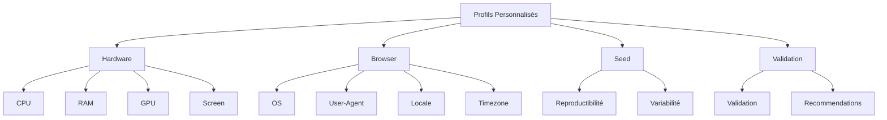

# Profils personnalisés

Guide avancé pour la création et l'optimisation de profils fingerprint personnalisés.

---

## 📋 Vue d'ensemble

Les profils personnalisés vous permettent de simuler des configurations matérielles et navigateur spécifiques pour maximiser l'évasion.



---

## 🏗️ Structure d'un profil

### Génération d'un profil complet

```python
from playwright_stealth import FingerprintProfile, HardwareTier, OSType

# Profil généré avec des paramètres spécifiques
profile = FingerprintProfile.generate(
    hardware_tier=HardwareTier.HIGH,
    os_type=OSType.WINDOWS,
    custom_seed="my_seed_42"
)

# Accès aux composants du profil
print(f"CPU: {profile.hardware.cpu_cores} cores")
print(f"RAM: {profile.hardware.ram_gb} GB")
print(f"OS: {profile.browser.os_type.value}")
print(f"Locale: {profile.browser.locale}")
```

### Propriétés disponibles

```python
# Profil
profile.id                    # Identifiant unique
profile.seed                  # Seed utilisée
profile.hardware              # HardwareProfile
profile.browser               # BrowserProfile
profile.network               # NetworkProfile
profile.display               # DisplayProfile
profile.locale                # LocaleProfile

# HardwareProfile
profile.hardware.cpu_cores    # Nombre de cœurs CPU
profile.hardware.cpu_model    # Modèle CPU
profile.hardware.ram_gb       # RAM en GB
profile.hardware.device_memory # navigator.deviceMemory
profile.hardware.gpu_model    # Modèle GPU
profile.hardware.gpu_vendor   # Vendor GPU
profile.hardware.screen_resolution # (width, height)
profile.hardware.device_pixel_ratio # DPI

# BrowserProfile
profile.browser.os_type       # OSType enum
profile.browser.platform      # Platform string
profile.browser.locale        # Locale string
profile.browser.timezone      # Timezone string
profile.browser.languages     # Tuple of languages
profile.browser.user_agent    # User-Agent string
```

---

## 🎯 Création de profils pour différentes configurations

### 1. Profil Windows 11 - Gaming

```python
from playwright_stealth import FingerprintProfile, HardwareTier, OSType

gaming_profile = FingerprintProfile.generate(
    hardware_tier=HardwareTier.PREMIUM,
    os_type=OSType.WINDOWS,
    custom_seed="gaming_win11"
)

# Le profil aura:
# - CPU: 16 cores
# - RAM: 32 GB
# - GPU NVIDIA RTX 4080
# - Windows 11
# - fr-FR locale
# - Europe/Paris timezone
```

### 2. Profil macOS - Développeur

```python
dev_profile = FingerprintProfile.generate(
    hardware_tier=HardwareTier.HIGH,
    os_type=OSType.MACOS,
    custom_seed="dev_macos"
)

# Le profil aura:
# - CPU: 8 cores
# - RAM: 16 GB
# - GPU Apple M2
# - macOS
# - en-US locale
# - America/New_York timezone
```

### 3. Profil Linux - Serveur

```python
linux_profile = FingerprintProfile.generate(
    hardware_tier=HardwareTier.MEDIUM,
    os_type=OSType.LINUX,
    custom_seed="linux_server"
)

# Le profil aura:
# - CPU: 4 cores
# - RAM: 8 GB
# - GPU Intel Iris
# - Linux
# - en-GB locale
# - Europe/London timezone
```

### 4. Profil Windows 10 - Bureau

```python
office_profile = FingerprintProfile.generate(
    hardware_tier=HardwareTier.MEDIUM,
    os_type=OSType.WINDOWS,
    custom_seed="office_win10"
)

# Le profil aura:
# - CPU: 4 cores
# - RAM: 8 GB
# - GPU Intel Iris
# - Windows 10
# - fr-FR locale
# - Europe/Paris timezone
```

---

## 📝 Utilisation des profils personnalisés

### Injection avec un profil personnalisé

```python
from playwright.sync_api import sync_playwright
from playwright_stealth import stealth_sync

with sync_playwright() as p:
    browser = p.chromium.launch()
    page = browser.new_page()
    
    # Utiliser le profil gaming
    stealth_sync(page, profile=gaming_profile)
    
    page.goto("https://example.com")
    browser.close()
```

### Rotation des profils

```python
import random

# Liste des profils
profiles = [
    gaming_profile,
    dev_profile,
    linux_profile,
    office_profile
]

urls_to_scrape = ["https://site1.com", "https://site2.com", "https://site3.com"]

for url in urls_to_scrape:
    # Sélectionner un profil aléatoire
    profile = random.choice(profiles)
    
    with sync_playwright() as p:
        browser = p.chromium.launch()
        page = browser.new_page()
        stealth_sync(page, profile=profile)
        
        page.goto(url)
        # Scraper la page...
        
        browser.close()
```

---

## 🔄 Seed et reproductibilité

### Utilisation des seeds

```python
# Même seed = même profil
profile_1 = FingerprintProfile.generate(
    hardware_tier=HardwareTier.MEDIUM,
    os_type=OSType.WINDOWS,
    custom_seed="42"
)

profile_2 = FingerprintProfile.generate(
    hardware_tier=HardwareTier.MEDIUM,
    os_type=OSType.WINDOWS,
    custom_seed="42"
)

# Les deux profils sont identiques
assert profile_1.id == profile_2.id
assert profile_1.seed == profile_2.seed

# Seed différent = profil différent
profile_3 = FingerprintProfile.generate(
    hardware_tier=HardwareTier.MEDIUM,
    os_type=OSType.WINDOWS,
    custom_seed="43"
)

assert profile_1.id != profile_3.id
```

### Génération de seeds pour la rotation

```python
import random

def generate_seeds(count=100):
    """Générer une liste de seeds uniques."""
    seeds = set()
    while len(seeds) < count:
        seed = str(random.randint(1, 10**6))
        seeds.add(seed)
    return list(seeds)

seeds = generate_seeds(50)

for seed in seeds:
    profile = FingerprintProfile.generate(
        hardware_tier=HardwareTier.MEDIUM,
        os_type=OSType.WINDOWS,
        custom_seed=seed
    )
    # Utiliser le profil...
```

---

## 🧪 Validation des profils

### Validation complète

```python
from playwright_stealth.services.validator import ProfileValidator

def validate_custom_profile(profile):
    validator = ProfileValidator()
    errors = validator.validate(profile)
    
    if not errors:
        print("✅ Profil valide")
        return profile
    
    print("⚠️ Problèmes détectés:")
    for error in errors:
        print(f"  - {error}")
    
    return profile

# Utilisation
validated_profile = validate_custom_profile(gaming_profile)
```

### Vérifications de cohérence

```python
from playwright_stealth.services.validator import ProfileValidator

# Vérifications effectuées par le validateur:
# 1. RAM vs Device Memory
# 2. GPU Vendor cohérent
# 3. Locale vs Timezone
# 4. User-Agent vs Platform
# 5. DPI vs Screen Resolution
# 6. Hardware Concurrency

validator = ProfileValidator()
errors = validator.validate(profile)

for error in errors:
    print(f"⚠️ {error}")
```

---

## 📁 Sauvegarde des profils en YAML

### Format YAML

```yaml
# config/profiles/custom_profile.yaml
id: custom_profile_001
hardware:
  cpu_cores: 8
  cpu_model: Intel Core i7-12700H
  cpu_vendor: Intel
  ram_gb: 16
  device_memory: 16
  gpu_vendor: NVIDIA Corporation
  gpu_renderer: ANGLE (NVIDIA, NVIDIA GeForce RTX 3060 Direct3D11)
  gpu_model: NVIDIA GeForce RTX 3060
  webgl_extensions:
    - ANGLE_instanced_arrays
    - EXT_blend_minmax
    - EXT_color_buffer_float
    - EXT_disjoint_timer_query
  max_texture_size: 32768
  max_combined_texture_image_units: 128
  max_vertex_uniform_vectors: 512
  max_fragment_uniform_vectors: 256
  max_varying_vectors: 32
  screen_resolution: [2560, 1440]
  color_depth: 32
  pixel_depth: 32
  device_pixel_ratio: 1.25
browser:
  vendor: chrome
  version: 120.0.6099.130
  chrome_version: 120.0.6099.130
  os_type: windows
  os_version: 11
  platform: Win32
  platform_version: 10.0.0
  locale: fr-FR
  languages: [fr-FR, fr, en-US, en]
  timezone: Europe/Paris
  user_agent: Mozilla/5.0 (Windows NT 10.0; Win64; x64) AppleWebKit/537.36 (KHTML, like Gecko) Chrome/120.0.0.0 Safari/537.36
  accept_language: fr-FR,fr;q=0.9,en-US;q=0.8,en;q=0.7
  platform_hint: Windows
  platform_version_hint: 10.0.0
  pdf_viewer_enabled: true
  fonts: [Arial, Helvetica, Times New Roman, Courier New, Verdana, Georgia, Tahoma]
  plugins:
    - [Chrome PDF Plugin, internal-pdf-viewer]
    - [Chrome PDF Viewer, mhjfbmdgcfjbbpaeojofohoefgiehjai]
    - [Native Client, internal-nacl-plugin]
  speech_voices:
    - {name: Google US English, lang: en-US}
    - {name: Google UK English Female, lang: en-GB}
    - {name: Google français, lang: fr-FR}
```

### Chargement depuis YAML

```python
from playwright_stealth.config.loader import ConfigLoader

# Charger un profil depuis YAML
loader = ConfigLoader()
profile_data = loader.load_profile("custom_profile")
print(f"Profil chargé: {profile_data['id']}")
```

---

## 💡 Recommandations

### Bonnes pratiques

```python
from playwright_stealth import FingerprintProfile, HardwareTier, OSType

# 1. Utiliser des seeds pour la reproductibilité
profile = FingerprintProfile.generate(
    hardware_tier=HardwareTier.MEDIUM,
    os_type=OSType.WINDOWS,
    custom_seed="stable_seed_123"
)

# 2. Vérifier la cohérence du profil
from playwright_stealth.services.validator import ProfileValidator
errors = ProfileValidator().validate(profile)
assert not errors, f"Profil invalide: {errors}"

# 3. Utiliser des profils différents pour chaque session
import time
seed = f"session_{time.time()}"
profile = FingerprintProfile.generate(
    hardware_tier=HardwareTier.MEDIUM,
    os_type=OSType.WINDOWS,
    custom_seed=seed
)
```

### À éviter

```python
# ❌ Profil incohérent (à ne pas faire)
# Ce code ne fonctionne pas - FingerprintProfile n'accepte pas ces paramètres
# profile = FingerprintProfile(
#     hardware=HardwareProfile(ram_gb=16, device_memory=4),
#     browser=BrowserProfile(os="Windows 11", user_agent="Macintosh...")
# )

# ✅ Profil cohérent
profile = FingerprintProfile.generate(
    hardware_tier=HardwareTier.HIGH,
    os_type=OSType.WINDOWS,
)
# Le profil est automatiquement cohérent
```

---

## 🔗 Navigation rapide

| Module | Description |
|--------|-------------|
| [API Core](../api/core.md) | Types et moteur |
| [API Config](../api/config.md) | Configuration |
| [Fingerprinting](fingerprinting.md) | Techniques avancées |
| [Evasion Modules](evasion_modules.md) | Modules d'évasion |

---

## 🚀 Prochaine étape

- 📖 [Modules d'évasion](evasion_modules.md)
- 📖 [Optimisation des performances](performance.md)
- 📖 [Guide de configuration](../guides/configuration.md)

---

**Dernière mise à jour** : 2026-07-19  
**Version** : 5.0.0