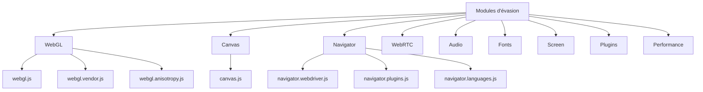

# Modules d'évasion

Documentation détaillée des modules d'évasion du framework Playwright Stealth.

---

## 📋 Vue d'ensemble

Les modules d'évasion sont des scripts JavaScript qui modifient les propriétés du navigateur pour masquer les traces d'automatisation.



---

## 📦 Liste des modules

| Module | Fichier | Description | Priorité |
|--------|---------|-------------|----------|
| **WebGL** | `webgl.js` | Masque les paramètres WebGL | 10 |
| **WebGL Vendor** | `webgl.vendor.js` | Masque le vendor GPU | 10 |
| **WebGL Anisotropy** | `webgl.anisotropy.js` | Simule l'extension d'anisotropie | 8 |
| **Canvas** | `canvas.js` | Brouille le fingerprint canvas | 8 |
| **WebDriver** | `navigator.webdriver.js` | Masque webdriver | 10 |
| **User-Agent** | `navigator.userAgent.js` | Modifie le User-Agent | 10 |
| **Vendor** | `navigator.vendor.js` | Modifie vendor | 9 |
| **Platform** | `navigator.platform.js` | Modifie platform | 9 |
| **Languages** | `navigator.languages.js` | Modifie les langues | 8 |
| **Permissions** | `navigator.permissions.js` | Modifie les permissions | 7 |
| **Device Memory** | `navigator.deviceMemory.js` | Modifie deviceMemory | 7 |
| **Hardware Concurrency** | `navigator.hardwareConcurrency.js` | Modifie hardwareConcurrency | 7 |
| **Max Touch Points** | `navigator.maxTouchPoints.js` | Modifie maxTouchPoints | 6 |
| **Plugins** | `navigator.plugins.js` | Modifie les plugins | 6 |
| **WebRTC** | `webrtc.js` | Masque les IP WebRTC | 7 |
| **Fonts** | `fonts.js` | Masque les polices | 5 |
| **Screen** | `screen.js` | Modifie les propriétés écran | 6 |
| **Window Outer** | `window.outerdimensions.js` | Modifie outer dimensions | 5 |
| **Audio** | `audio.js` | Modifie le fingerprint audio | 5 |
| **Intl** | `intl.js` | Modifie locale/timezone | 6 |
| **Media Codecs** | `media.codecs.js` | Modifie les codecs média | 5 |
| **Errors** | `errors.js` | Nettoie les stacks d'erreur | 8 |
| **Chrome Runtime** | `chrome.runtime.js` | Simule chrome.runtime | 9 |
| **Chrome App** | `chrome.app.js` | Simule chrome.app | 7 |
| **Chrome CSI** | `chrome.csi.js` | Simule chrome.csi | 6 |
| **Chrome LoadTimes** | `chrome.load.times.js` | Simule chrome.loadTimes | 6 |
| **Magic Arrays** | `generate.magic.arrays.js` | Génère des tableaux magiques | 8 |
| **iframe** | `iframe.contentWindow.js` | Patch contentWindow | 6 |
| **Utils** | `utils.js` | Utilitaires | - |

---

## 📄 Structure d'un module

### Fonctionnement des modules

Les modules sont chargés via `ScriptLoader` et injectés dans la page via `page.add_init_script()`.

### Template de module

```javascript
// playwright_stealth/js/template.js
(function() {
    'use strict';
    
    // 1. Configuration du module
    const MODULE = {
        id: 'module_id',
        name: 'Module Name',
        version: '1.0.0',
        priority: 5
    };
    
    // 2. Fonction principale
    function applyModule(opts) {
        try {
            // Logique de modification
            applyPatch(opts);
            return true;
        } catch (error) {
            console.error('[Stealth] Erreur module:', error);
            return false;
        }
    }
    
    // 3. Logique de modification
    function applyPatch(opts) {
        // Implémentation du module
        // Les options sont disponibles via window.__STEALTH_OPTS__
    }
    
    // 4. Exécution du module
    const opts = window.__STEALTH_OPTS__ || {};
    applyModule(opts);
    
})();
```

---

## 🔍 Modules détaillés

### 1. `webgl.vendor.js`

Masque le vendor GPU exposé par WebGL.

```javascript
// playwright_stealth/js/webgl.vendor.js
(function() {
    'use strict';
    
    // Récupérer les options
    var opts = window.__STEALTH_OPTS__ || {};
    
    // Constantes WebGL
    var UNMASKED_VENDOR_WEBGL = 37445;
    var UNMASKED_RENDERER_WEBGL = 37446;
    
    // Vérifier que WebGL existe
    if (typeof WebGLRenderingContext === 'undefined') {
        return;
    }
    
    // Déterminer le vendor et renderer
    var vendor = opts.webgl_vendor || 'Intel Inc.';
    var renderer = opts.webgl_renderer || 'ANGLE (Intel, Intel Iris Xe Graphics Direct3D11)';
    
    // Patch getParameter
    var originalGetParameter = WebGLRenderingContext.prototype.getParameter;
    WebGLRenderingContext.prototype.getParameter = function(parameter) {
        if (parameter === UNMASKED_VENDOR_WEBGL) {
            return vendor;
        }
        if (parameter === UNMASKED_RENDERER_WEBGL) {
            return renderer;
        }
        return originalGetParameter.call(this, parameter);
    };
    
    // Appliquer également aux contextes WebGL2
    if (typeof WebGL2RenderingContext !== 'undefined') {
        WebGL2RenderingContext.prototype.getParameter = WebGLRenderingContext.prototype.getParameter;
    }
})();
```

### 2. `canvas.js`

Brouille le fingerprint canvas en ajoutant du bruit déterministe.

```javascript
// playwright_stealth/js/canvas.js
(function() {
    'use strict';
    
    var opts = window.__STEALTH_OPTS__ || {};
    var seed = opts.seed || 12345;
    
    // Fonction de bruit déterministe
    function deterministicNoise(seed, x, y, channel) {
        var value = seed + x * 0.01 + y * 0.013 + channel * 0.017;
        var noise = Math.sin(value * 10000) * Math.cos(value * 7777) * Math.sin(value * 5555);
        return Math.max(-1, Math.min(1, noise));
    }
    
    // Patch getImageData
    if (typeof CanvasRenderingContext2D !== 'undefined') {
        var originalGetImageData = CanvasRenderingContext2D.prototype.getImageData;
        
        CanvasRenderingContext2D.prototype.getImageData = function(x, y, w, h) {
            var result = originalGetImageData.call(this, x, y, w, h);
            var data = result.data;
            var noiseAmount = 0.5 + (seed % 50) / 100;
            
            for (var py = 0; py < h; py++) {
                for (var px = 0; px < w; px++) {
                    var idx = (py * w + px) * 4;
                    for (var channel = 0; channel < 4; channel++) {
                        var noise = deterministicNoise(seed, x + px, y + py, channel) * noiseAmount;
                        data[idx + channel] = Math.max(0, Math.min(255, data[idx + channel] + noise));
                    }
                }
            }
            
            return result;
        };
    }
    
    // Patch toDataURL
    if (typeof HTMLCanvasElement !== 'undefined') {
        var originalToDataURL = HTMLCanvasElement.prototype.toDataURL;
        
        HTMLCanvasElement.prototype.toDataURL = function(type, quality) {
            if (!type || type === 'image/png') {
                var ctx = this.getContext('2d');
                if (ctx) {
                    var imageData = ctx.getImageData(0, 0, this.width, this.height);
                    var data = imageData.data;
                    var noiseAmount = 0.3 + (seed % 30) / 100;
                    
                    for (var i = 0; i < data.length; i += 4) {
                        for (var channel = 0; channel < 3; channel++) {
                            var px = (i / 4) % this.width;
                            var py = Math.floor((i / 4) / this.width);
                            var noise = deterministicNoise(seed + i, px, py, channel) * noiseAmount;
                            data[i + channel] = Math.max(0, Math.min(255, data[i + channel] + noise));
                        }
                    }
                    ctx.putImageData(imageData, 0, 0);
                }
            }
            return originalToDataURL.call(this, type, quality);
        };
    }
})();
```

### 3. `navigator.webdriver.js`

Masque `navigator.webdriver`.

```javascript
// playwright_stealth/js/navigator.webdriver.js
(function() {
    'use strict';
    
    if (typeof navigator === 'undefined') return;
    
    // Supprimer webdriver de tous les prototypes
    function removeWebdriver() {
        try {
            var proto = Object.getPrototypeOf(navigator);
            if (proto && Object.getOwnPropertyDescriptor(proto, 'webdriver')) {
                delete proto.webdriver;
            }
            if (Object.getOwnPropertyDescriptor(navigator, 'webdriver')) {
                delete navigator.webdriver;
            }
        } catch (e) {
            // Ignorer
        }
    }
    
    // Masquer webdriver
    function maskWebdriver() {
        try {
            Object.defineProperty(navigator, 'webdriver', {
                value: undefined,
                writable: false,
                enumerable: false,
                configurable: false
            });
        } catch (e) {
            // Ignorer
        }
    }
    
    // Appliquer les patches
    removeWebdriver();
    maskWebdriver();
    
    // Proxy sur navigator pour interception avancée
    try {
        var navigatorHandler = {
            get: function(target, prop) {
                if (prop === 'webdriver') return undefined;
                return Reflect.get(target, prop);
            },
            has: function(target, prop) {
                if (prop === 'webdriver') return false;
                return Reflect.has(target, prop);
            }
        };
        
        var navigatorProxy = new Proxy(navigator, navigatorHandler);
        Object.defineProperty(window, 'navigator', {
            value: navigatorProxy,
            configurable: false,
            enumerable: true,
            writable: false
        });
    } catch (e) {
        // Ignorer
    }
})();
```

### 4. `webrtc.js`

Masque les informations IP exposées par WebRTC.

```javascript
// playwright_stealth/js/webrtc.js
(function() {
    'use strict';
    
    if (typeof RTCPeerConnection === 'undefined') return;
    
    var originalRTCPeerConnection = RTCPeerConnection;
    var localIP = '0.0.0.0';
    
    // Fonction pour masquer les IPs
    function maskICEAddress(sdp) {
        return sdp.replace(/(\d{1,3}\.){3}\d{1,3}/g, function(match) {
            var parts = match.split('.');
            if (parts.length === 4) {
                var first = parseInt(parts[0], 10);
                var second = parseInt(parts[1], 10);
                // IPs privées
                if (first === 10 || (first === 172 && second >= 16 && second <= 31) ||
                    (first === 192 && second === 168) || match === '127.0.0.1') {
                    return localIP;
                }
            }
            return match;
        });
    }
    
    // Patch createOffer
    var originalCreateOffer = RTCPeerConnection.prototype.createOffer;
    RTCPeerConnection.prototype.createOffer = function(options) {
        return originalCreateOffer.call(this, options).then(function(offer) {
            if (offer && offer.sdp) {
                offer.sdp = maskICEAddress(offer.sdp);
            }
            return offer;
        });
    };
    
    // Patch createAnswer
    var originalCreateAnswer = RTCPeerConnection.prototype.createAnswer;
    RTCPeerConnection.prototype.createAnswer = function(options) {
        return originalCreateAnswer.call(this, options).then(function(answer) {
            if (answer && answer.sdp) {
                answer.sdp = maskICEAddress(answer.sdp);
            }
            return answer;
        });
    };
})();
```

### 5. `audio.js`

Modifie le fingerprint audio en ajoutant du bruit déterministe.

```javascript
// playwright_stealth/js/audio.js
(function() {
    'use strict';
    
    var opts = window.__STEALTH_OPTS__ || {};
    var seed = opts.seed || 42;
    
    function deterministicNoise(seed, index) {
        var value = seed + index * 0.01;
        var noise = Math.sin(value * 10000) * Math.cos(value * 7777);
        return Math.max(-1, Math.min(1, noise));
    }
    
    // Patch getChannelData
    if (typeof AudioBuffer !== 'undefined') {
        var originalGetChannelData = AudioBuffer.prototype.getChannelData;
        
        AudioBuffer.prototype.getChannelData = function(channel) {
            var result = originalGetChannelData.call(this, channel);
            var noiseAmount = 0.0001 + (seed % 100) / 1000000;
            var step = Math.max(1, Math.floor(result.length / 100));
            
            for (var i = 0; i < result.length; i += step) {
                var noise = deterministicNoise(seed, i) * noiseAmount;
                result[i] = Math.max(-1, Math.min(1, result[i] + noise));
            }
            
            return result;
        };
    }
    
    // Patch AnalyserNode
    if (typeof AnalyserNode !== 'undefined') {
        var originalGetByteFrequencyData = AnalyserNode.prototype.getByteFrequencyData;
        
        AnalyserNode.prototype.getByteFrequencyData = function(array) {
            originalGetByteFrequencyData.call(this, array);
            var noiseAmount = 0.5 + (seed % 50) / 100;
            for (var i = 0; i < array.length; i++) {
                var noise = deterministicNoise(seed + i, i) * noiseAmount;
                array[i] = Math.max(0, Math.min(255, array[i] + noise));
            }
            return array;
        };
    }
})();
```

---

## 🧪 Test des modules

### Vérification des modules injectés

```python
from playwright.sync_api import sync_playwright
from playwright_stealth import stealth_sync

def test_modules_injected():
    """Vérifier que les modules sont injectés."""
    with sync_playwright() as p:
        browser = p.chromium.launch()
        page = browser.new_page()
        
        # Injecter le stealth
        stealth_sync(page)
        
        # Vérifier webdriver
        webdriver = page.evaluate("navigator.webdriver")
        assert webdriver is None or webdriver is False
        
        # Vérifier les plugins
        plugins_length = page.evaluate("navigator.plugins.length")
        assert plugins_length > 0
        
        browser.close()
```

### Liste des modules injectés

```python
from playwright_stealth.services.builder import BuilderService

# Récupérer la liste des modules disponibles
modules = BuilderService.list_available_modules()
print(f"Modules disponibles: {len(modules)}")

for module in modules:
    print(f"  - {module}")
```

---

## 📊 Matrice des modules

| Module | Détection | Évasion | Performance | Priorité |
|--------|-----------|---------|-------------|----------|
| `webgl.js` | Élevée | Élevée | Basse | 10 |
| `webgl.vendor.js` | Élevée | Élevée | Basse | 10 |
| `webgl.anisotropy.js` | Moyenne | Élevée | Basse | 8 |
| `canvas.js` | Élevée | Élevée | Moyenne | 8 |
| `navigator.webdriver.js` | Élevée | Élevée | Basse | 10 |
| `navigator.userAgent.js` | Élevée | Élevée | Basse | 10 |
| `navigator.vendor.js` | Élevée | Élevée | Basse | 9 |
| `navigator.platform.js` | Élevée | Élevée | Basse | 9 |
| `navigator.languages.js` | Moyenne | Moyenne | Basse | 8 |
| `navigator.permissions.js` | Moyenne | Moyenne | Basse | 7 |
| `navigator.deviceMemory.js` | Moyenne | Moyenne | Basse | 7 |
| `navigator.hardwareConcurrency.js` | Moyenne | Moyenne | Basse | 7 |
| `navigator.maxTouchPoints.js` | Faible | Faible | Basse | 6 |
| `navigator.plugins.js` | Moyenne | Moyenne | Basse | 6 |
| `webrtc.js` | Moyenne | Élevée | Moyenne | 7 |
| `fonts.js` | Faible | Faible | Basse | 5 |
| `screen.js` | Moyenne | Moyenne | Basse | 6 |
| `window.outerdimensions.js` | Faible | Faible | Basse | 5 |
| `audio.js` | Moyenne | Moyenne | Basse | 5 |
| `intl.js` | Moyenne | Moyenne | Basse | 6 |
| `media.codecs.js` | Moyenne | Moyenne | Basse | 5 |
| `errors.js` | Élevée | Élevée | Basse | 8 |
| `chrome.runtime.js` | Élevée | Élevée | Basse | 9 |
| `chrome.app.js` | Moyenne | Moyenne | Basse | 7 |
| `chrome.csi.js` | Faible | Faible | Basse | 6 |
| `chrome.load.times.js` | Faible | Faible | Basse | 6 |
| `iframe.contentWindow.js` | Moyenne | Élevée | Basse | 6 |

---

## 🔗 Ressources utiles

- [WebGL Specification](https://www.khronos.org/registry/webgl/specs/latest/1.0/)
- [Canvas API Documentation](https://developer.mozilla.org/en-US/docs/Web/API/Canvas_API)
- [Navigator API Reference](https://developer.mozilla.org/en-US/docs/Web/API/Navigator)
- [WebRTC Documentation](https://webrtc.org/)

---

## 🚀 Prochaine étape

- 📖 [Optimisation des performances](performance.md)
- 📖 [Testing avancé](testing.md)
- 📖 [Guide de configuration](../guides/configuration.md)

---

**Dernière mise à jour** : 2026-07-19  
**Version** : 5.0.0