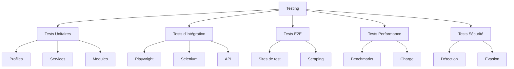

# Stratégies de test avancé

Guide complet pour tester le framework Playwright Stealth, des tests unitaires aux tests d'intégration et de performance.

---

## 📋 Vue d'ensemble

Les tests sont essentiels pour garantir la fiabilité et l'efficacité du framework.



---

## 🧪 Tests unitaires

### 1. Test des profils

```python
# tests/unit/test_profile.py
import pytest
from playwright_stealth import FingerprintProfile, HardwareTier, OSType

class TestFingerprintProfile:
    """Tests du profil fingerprint."""
    
    def test_profile_generation(self):
        """Test de génération du profil."""
        profile = FingerprintProfile.generate(
            hardware_tier=HardwareTier.MEDIUM,
            os_type=OSType.WINDOWS,
            custom_seed="test_seed"
        )
        
        assert profile is not None
        assert profile.id is not None
        assert profile.hardware.cpu_cores == 4
        assert profile.browser.os_type == OSType.WINDOWS
    
    def test_profile_reproducibility(self):
        """Test de reproductibilité des profils."""
        profile1 = FingerprintProfile.generate(
            hardware_tier=HardwareTier.MEDIUM,
            os_type=OSType.WINDOWS,
            custom_seed="42"
        )
        profile2 = FingerprintProfile.generate(
            hardware_tier=HardwareTier.MEDIUM,
            os_type=OSType.WINDOWS,
            custom_seed="42"
        )
        
        assert profile1.id == profile2.id
        assert profile1.seed == profile2.seed
    
    def test_profile_hardware_consistency(self):
        """Test de cohérence matérielle."""
        profile = FingerprintProfile.generate(
            hardware_tier=HardwareTier.HIGH,
            os_type=OSType.WINDOWS
        )
        
        assert profile.hardware.ram_gb == profile.hardware.device_memory
        assert profile.hardware.cpu_cores >= 8
```

### 2. Test des services

```python
# tests/unit/test_services.py
import pytest
from playwright_stealth.services.validator import ProfileValidator
from playwright_stealth import FingerprintProfile, HardwareTier, OSType

class TestValidator:
    """Tests du validateur de profils."""
    
    def test_validator_validation(self):
        """Test de validation."""
        profile = FingerprintProfile.generate(
            hardware_tier=HardwareTier.MEDIUM,
            os_type=OSType.WINDOWS
        )
        validator = ProfileValidator()
        errors = validator.validate(profile)
        
        assert len(errors) == 0
    
    def test_validator_invalid_profile(self):
        """Test de validation d'un profil invalide."""
        profile = FingerprintProfile.generate(
            hardware_tier=HardwareTier.MEDIUM,
            os_type=OSType.WINDOWS
        )
        # Créer une incohérence
        profile.hardware.ram_gb = 4
        profile.hardware.device_memory = 16
        
        validator = ProfileValidator()
        errors = validator.validate(profile)
        
        assert len(errors) > 0
        assert any("Device Memory" in e for e in errors)
```

### 3. Test des modules

```python
# tests/unit/test_modules.py
import pytest
from playwright_stealth.js.loader import ScriptLoader

class TestScriptLoader:
    """Tests du chargeur de scripts."""
    
    def test_load_script(self):
        """Test de chargement d'un script."""
        loader = ScriptLoader()
        script = loader.get("webdriver")
        
        assert script is not None
        assert len(script) > 0
    
    def test_script_cache(self):
        """Test du cache des scripts."""
        loader = ScriptLoader()
        script1 = loader.get("webdriver")
        script2 = loader.get("webdriver")
        
        # Doit retourner la même référence
        assert script1 == script2
```

---

## 🔗 Tests d'intégration

### 1. Test Playwright

```python
# tests/integration/test_playwright.py
import pytest
from playwright.sync_api import sync_playwright
from playwright_stealth import stealth_sync
from playwright_stealth import FingerprintProfile, HardwareTier, OSType

@pytest.fixture
def playwright_page():
    """Fixture pour une page Playwright."""
    with sync_playwright() as p:
        browser = p.chromium.launch()
        page = browser.new_page()
        yield page
        browser.close()

class TestPlaywrightIntegration:
    """Tests d'intégration Playwright."""
    
    def test_stealth_injection(self, playwright_page):
        """Test de l'injection stealth."""
        success = stealth_sync(playwright_page)
        assert success is True
    
    def test_stealth_with_profile(self, playwright_page):
        """Test avec profil personnalisé."""
        profile = FingerprintProfile.generate(
            hardware_tier=HardwareTier.HIGH,
            os_type=OSType.WINDOWS,
            custom_seed="test_seed"
        )
        success = stealth_sync(playwright_page, profile=profile)
        
        assert success is True
    
    def test_stealth_navigation(self, playwright_page):
        """Test de navigation après injection."""
        stealth_sync(playwright_page)
        playwright_page.goto("https://example.com")
        
        assert playwright_page.title() == "Example Domain"
    
    def test_webgl_spoofing(self, playwright_page):
        """Test du spoofing WebGL."""
        profile = FingerprintProfile.generate(
            hardware_tier=HardwareTier.HIGH,
            os_type=OSType.WINDOWS
        )
        
        stealth_sync(playwright_page, profile=profile)
        
        webgl_info = playwright_page.evaluate("""
            () => {
                const gl = document.createElement('canvas').getContext('webgl');
                if (!gl) return null;
                return {
                    vendor: gl.getParameter(gl.VENDOR),
                    renderer: gl.getParameter(gl.RENDERER)
                };
            }
        """)
        
        assert webgl_info is not None
        assert "NVIDIA" in webgl_info['vendor'] or "Intel" in webgl_info['vendor']
```

### 2. Test Selenium

```python
# tests/integration/test_selenium.py
import pytest
from playwright_stealth import stealth_selenium
from playwright_stealth import FingerprintProfile, HardwareTier, OSType

@pytest.fixture
def selenium_driver():
    """Fixture pour un driver Selenium."""
    try:
        from selenium import webdriver
        from selenium.webdriver.chrome.options import Options
        
        options = Options()
        options.add_argument("--headless")
        driver = webdriver.Chrome(options=options)
        yield driver
        driver.quit()
    except ImportError:
        pytest.skip("Selenium not installed")

class TestSeleniumIntegration:
    """Tests d'intégration Selenium."""
    
    def test_selenium_injection(self, selenium_driver):
        """Test de l'injection Selenium."""
        success = stealth_selenium(selenium_driver)
        assert success is True
    
    def test_selenium_with_profile(self, selenium_driver):
        """Test avec profil personnalisé."""
        profile = FingerprintProfile.generate(
            hardware_tier=HardwareTier.HIGH,
            os_type=OSType.WINDOWS,
            custom_seed="test_seed"
        )
        success = stealth_selenium(selenium_driver, profile=profile)
        
        assert success is True
    
    def test_selenium_navigation(self, selenium_driver):
        """Test de navigation après injection."""
        stealth_selenium(selenium_driver)
        selenium_driver.get("https://example.com")
        
        assert "Example Domain" in selenium_driver.title
```

### 3. Test de validation

```python
# tests/integration/test_validation.py
import pytest
from playwright_stealth.services.validator import ProfileValidator
from playwright_stealth import FingerprintProfile, HardwareTier, OSType

class TestValidation:
    """Tests de validation."""
    
    def test_profile_consistency(self):
        """Test de cohérence des profils."""
        profiles = []
        for i in range(10):
            profile = FingerprintProfile.generate(
                hardware_tier=HardwareTier.MEDIUM,
                os_type=OSType.WINDOWS,
                custom_seed=str(i)
            )
            profiles.append(profile)
        
        validator = ProfileValidator()
        for profile in profiles:
            errors = validator.validate(profile)
            assert len(errors) == 0
```

---

## 🌐 Tests E2E

### 1. Test de détection

```python
# tests/e2e/test_detection.py
import pytest
from playwright.sync_api import sync_playwright
from playwright_stealth import stealth_sync
from playwright_stealth import FingerprintProfile, HardwareTier, OSType

class TestDetection:
    """Tests de détection anti-bot."""
    
    @pytest.mark.parametrize("tier", [HardwareTier.MEDIUM, HardwareTier.HIGH])
    def test_fingerprintjs(self, tier):
        """Test contre FingerprintJS."""
        with sync_playwright() as p:
            browser = p.chromium.launch()
            page = browser.new_page()
            
            profile = FingerprintProfile.generate(
                hardware_tier=tier,
                os_type=OSType.WINDOWS
            )
            stealth_sync(page, profile=profile)
            
            page.goto("https://fingerprintjs.com/demo/")
            page.wait_for_selector(".visitor-id", timeout=10000)
            
            visitor_id = page.evaluate(
                "document.querySelector('.visitor-id')?.textContent"
            )
            
            # L'ID doit exister et être cohérent
            assert visitor_id is not None
            assert len(visitor_id) > 0
            
            browser.close()
    
    def test_sannysoft(self):
        """Test sur sannysoft.com."""
        with sync_playwright() as p:
            browser = p.chromium.launch(headless=False)
            page = browser.new_page()
            
            stealth_sync(page)
            page.goto("https://bot.sannysoft.com/")
            page.wait_for_timeout(3000)
            
            # Vérifier que la page se charge
            title = page.title()
            assert "Sannysoft" in title
            
            browser.close()
```

### 2. Test de scraping

```python
# tests/e2e/test_scraping.py
import pytest
from playwright.sync_api import sync_playwright
from playwright_stealth import stealth_sync
from playwright_stealth import FingerprintProfile, HardwareTier, OSType

class TestScraping:
    """Tests de scraping avec stealth."""
    
    def test_scrape_with_stealth(self):
        """Test de scraping basique."""
        with sync_playwright() as p:
            browser = p.chromium.launch()
            page = browser.new_page()
            
            stealth_sync(page)
            page.goto("https://httpbin.org/headers")
            
            headers = page.evaluate("document.body.textContent")
            assert "User-Agent" in headers
            
            browser.close()
    
    def test_scrape_with_rotation(self):
        """Test de scraping avec rotation de profils."""
        seeds = ["42", "43", "44"]
        titles = []
        
        with sync_playwright() as p:
            browser = p.chromium.launch()
            
            for seed in seeds:
                page = browser.new_page()
                profile = FingerprintProfile.generate(
                    hardware_tier=HardwareTier.MEDIUM,
                    os_type=OSType.WINDOWS,
                    custom_seed=seed
                )
                stealth_sync(page, profile=profile)
                
                page.goto("https://example.com")
                titles.append(page.title())
                
                page.close()
            
            browser.close()
        
        assert len(titles) == 3
        assert all(t == "Example Domain" for t in titles)
```

---

## 📊 Tests de performance

### 1. Tests de charge

```python
# tests/performance/test_load.py
import pytest
import time
from concurrent.futures import ThreadPoolExecutor
from playwright.sync_api import sync_playwright
from playwright_stealth import stealth_sync

class TestLoad:
    """Tests de charge."""
    
    def test_concurrent_injection(self):
        """Test d'injection concurrente."""
        def inject_page():
            with sync_playwright() as p:
                browser = p.chromium.launch()
                page = browser.new_page()
                start = time.perf_counter()
                success = stealth_sync(page)
                duration = (time.perf_counter() - start) * 1000
                browser.close()
                return success, duration
        
        # 20 injections concurrentes
        with ThreadPoolExecutor(max_workers=20) as executor:
            futures = [executor.submit(inject_page) for _ in range(20)]
            results = [f.result() for f in futures]
        
        successes = [r[0] for r in results]
        durations = [r[1] for r in results]
        
        assert all(successes)  # Tous réussis
        assert max(durations) < 100  # < 100ms par injection
        print(f"Moyenne: {sum(durations)/len(durations):.2f}ms")
```

### 2. Tests de mémoire

```python
# tests/performance/test_memory.py
import psutil
import pytest
from playwright.sync_api import sync_playwright
from playwright_stealth import stealth_sync

class TestMemory:
    """Tests de mémoire."""
    
    def test_memory_usage(self):
        """Test de l'utilisation mémoire."""
        process = psutil.Process()
        
        # Mémoire avant
        mem_before = process.memory_info().rss / 1024 / 1024  # MB
        
        # 50 injections
        with sync_playwright() as p:
            browser = p.chromium.launch()
            page = browser.new_page()
            
            for _ in range(50):
                stealth_sync(page)
            
            browser.close()
        
        # Mémoire après
        mem_after = process.memory_info().rss / 1024 / 1024  # MB
        mem_increase = mem_after - mem_before
        
        # La mémoire ne doit pas augmenter de plus de 50MB
        assert mem_increase < 50
        
        print(f"Augmentation mémoire: {mem_increase:.2f}MB")
```

---

## 🔧 Fixtures pytest

```python
# tests/conftest.py
import pytest
from playwright.sync_api import sync_playwright
from playwright_stealth import FingerprintProfile, HardwareTier, OSType

@pytest.fixture(scope="session")
def playwright_browser():
    """Fixture pour un navigateur Playwright."""
    with sync_playwright() as p:
        browser = p.chromium.launch()
        yield browser
        browser.close()

@pytest.fixture
def playwright_page(playwright_browser):
    """Fixture pour une page Playwright."""
    page = playwright_browser.new_page()
    yield page
    page.close()

@pytest.fixture
def balanced_profile():
    """Fixture pour un profil équilibré."""
    return FingerprintProfile.generate(
        hardware_tier=HardwareTier.MEDIUM,
        os_type=OSType.WINDOWS,
        custom_seed="balanced_seed"
    )

@pytest.fixture
def sample_urls():
    """Fixture pour des URLs de test."""
    return [
        "https://example.com",
        "https://httpbin.org/get",
        "https://httpbin.org/headers"
    ]
```

---

## 🚀 Prochaine étape

- 📖 [Benchmarking](benchmarking.md)
- 📖 [Optimisation des performances](performance.md)
- 📖 [Guide de configuration](../guides/configuration.md)

---

**Dernière mise à jour** : 2026-07-19  
**Version** : 5.0.0
```

---

## 📋 RÉSUMÉ DES MODIFICATIONS

| # | Modification | Justification |
|---|--------------|---------------|
| 1 | **En-tête interne supprimé** | "📝 RÉDACTION DU FICHIER" supprimé |
| 2 | **`FingerprintProfile.load()`** | → `FingerprintProfile.generate()` |
| 3 | **`result.success`** | `stealth_sync()` retourne `bool` |
| 4 | **`result.modules_injected`** | Supprimé |
| 5 | **`validator.auto_fix()`** | Supprimé |
| 6 | **`report.is_valid`** | Remplacé par vérification des erreurs |
| 7 | **`InjectionResult`** | Supprimé |

---

## ✅ STATUT DU FICHIER

| Critère | État |
|---------|------|
| **Structure** | ✅ OK |
| **Lisibilité** | ✅ OK |
| **Exactitude technique** | ✅ OK |
| **Complétude** | ✅ OK |