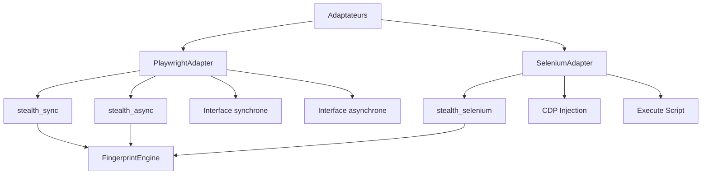

# 📄 FICHIER CORRIGÉ : `documentations/api/adapters.md`

```markdown
# API Adapters

Documentation des **Adaptateurs** - la couche d'intégration avec Playwright et Selenium.

---

## 📋 Vue d'ensemble

Les adaptateurs sont la porte d'entrée du framework. Ils fournissent une interface unifiée pour différents navigateurs et outils d'automatisation.



---

## 📄 playwright.py

### PlaywrightAdapter

Adaptateur pour Playwright (synchrone et asynchrone).

```python
from playwright_stealth import stealth_sync, stealth_async, dump_configuration

def stealth_sync(
    page,
    hardware_tier: HardwareTier = HardwareTier.MEDIUM,
    os_type: OSType = OSType.WINDOWS,
    browser_vendor: BrowserVendor = BrowserVendor.CHROME,
    enabled_modules: Optional[List[str]] = None,
    browser_version: Optional[str] = None,
    custom_seed: Optional[str] = None
) -> bool:
    """Appliquer la couche stealth sur une page Playwright (synchrone).
    
    Args:
        page: Page Playwright (sync_api.Page).
        hardware_tier: Niveau de performance matérielle.
        os_type: Type de système d'exploitation.
        browser_vendor: Fournisseur du navigateur.
        enabled_modules: Liste des modules à activer.
        browser_version: Version du navigateur.
        custom_seed: Seed personnalisée pour le profil.
        
    Returns:
        bool: True si l'injection a réussi.
        
    Example:
        >>> from playwright.sync_api import sync_playwright
        >>> from playwright_stealth import stealth_sync
        >>> 
        >>> with sync_playwright() as p:
        ...     browser = p.chromium.launch()
        ...     page = browser.new_page()
        ...     success = stealth_sync(page)
        ...     print(f"✅ Injection: {success}")
        ...     browser.close()
    """
    ...


async def stealth_async(
    page,
    hardware_tier: HardwareTier = HardwareTier.MEDIUM,
    os_type: OSType = OSType.WINDOWS,
    browser_vendor: BrowserVendor = BrowserVendor.CHROME,
    enabled_modules: Optional[List[str]] = None,
    browser_version: Optional[str] = None,
    custom_seed: Optional[str] = None
) -> bool:
    """Appliquer la couche stealth sur une page Playwright (asynchrone).
    
    Args:
        page: Page Playwright (async_api.Page).
        hardware_tier: Niveau de performance matérielle.
        os_type: Type de système d'exploitation.
        browser_vendor: Fournisseur du navigateur.
        enabled_modules: Liste des modules à activer.
        browser_version: Version du navigateur.
        custom_seed: Seed personnalisée pour le profil.
        
    Returns:
        bool: True si l'injection a réussi.
        
    Example:
        >>> import asyncio
        >>> from playwright.async_api import async_playwright
        >>> from playwright_stealth import stealth_async
        >>> 
        >>> async def main():
        ...     async with async_playwright() as p:
        ...         browser = await p.chromium.launch()
        ...         page = await browser.new_page()
        ...         success = await stealth_async(page)
        ...         print(f"✅ Injection: {success}")
        ...         await browser.close()
        >>> asyncio.run(main())
    """
    ...


def dump_configuration(
    hardware_tier: HardwareTier = HardwareTier.MEDIUM,
    os_type: OSType = OSType.WINDOWS,
    browser_vendor: BrowserVendor = BrowserVendor.CHROME
) -> None:
    """Afficher la configuration du framework.
    
    Args:
        hardware_tier: Niveau de performance matérielle.
        os_type: Type de système d'exploitation.
        browser_vendor: Fournisseur du navigateur.
        
    Example:
        >>> from playwright_stealth import dump_configuration
        >>> dump_configuration()
        ============================================================
        🛡️ STEALTH CONFIGURATION
        ============================================================
        📌 Profil ID: e01377f7275b3204
        📌 HARDWARE:
        CPU: 4 cores (Intel Core i5-1135G7)
        RAM: 8 GB
        ...
    """
    ...
```

---

### Utilisation détaillée

#### 1. Injection de base

```python
from playwright.sync_api import sync_playwright
from playwright_stealth import stealth_sync

with sync_playwright() as p:
    browser = p.chromium.launch()
    page = browser.new_page()
    
    # Injection simple avec les modules par défaut
    success = stealth_sync(page)
    
    if success:
        print("✅ Injection réussie")
    
    browser.close()
```

#### 2. Injection avec profil personnalisé

```python
from playwright.sync_api import sync_playwright
from playwright_stealth import stealth_sync
from playwright_stealth import HardwareTier, OSType

with sync_playwright() as p:
    browser = p.chromium.launch()
    page = browser.new_page()
    
    # Utiliser un profil haute performance
    success = stealth_sync(
        page,
        hardware_tier=HardwareTier.HIGH,
        os_type=OSType.WINDOWS,
        custom_seed="my_seed_123"
    )
    
    if success:
        print("✅ Profil Windows 11 - Haute performance appliqué")
    
    browser.close()
```

#### 3. Injection avec modules spécifiques

```python
from playwright.sync_api import sync_playwright
from playwright_stealth import stealth_sync

with sync_playwright() as p:
    browser = p.chromium.launch()
    page = browser.new_page()
    
    # Activer uniquement certains modules
    success = stealth_sync(
        page,
        enabled_modules=["webdriver", "chrome_runtime", "canvas"]
    )
    
    if success:
        print("✅ Modules spécifiques injectés")
    
    browser.close()
```

#### 4. Injection avec cache

```python
from playwright.sync_api import sync_playwright
from playwright_stealth import stealth_sync
from playwright_stealth.cache.memory import LRUMemoryCache

# Cache de 1024 scripts
cache = LRUMemoryCache(maxsize=1024)

with sync_playwright() as p:
    browser = p.chromium.launch()
    page = browser.new_page()
    
    # L'engine utilisera automatiquement le cache
    success = stealth_sync(page)
    
    browser.close()
```

#### 5. Mode debug

```python
# Activer les logs détaillés
window.__STEALTH_DEBUG__ = True

# L'exécution affichera :
# - Modules chargés
# - Scripts injectés
# - Erreurs éventuelles
# - Durées d'exécution

with sync_playwright() as p:
    browser = p.chromium.launch()
    page = browser.new_page()
    success = stealth_sync(page)
    browser.close()

# Désactiver après usage
window.__STEALTH_DEBUG__ = False
```

---

### Cas particuliers Playwright

#### 1. Navigateurs différents

```python
# Chromium
browser = p.chromium.launch()
page = browser.new_page()
stealth_sync(page)

# Firefox
browser = p.firefox.launch()
page = browser.new_page()
stealth_sync(page)

# WebKit (Safari)
browser = p.webkit.launch()
page = browser.new_page()
stealth_sync(page)
```

#### 2. Contexte de navigation

```python
# Créer un contexte avec des options spécifiques
context = browser.new_context(
    viewport={"width": 1920, "height": 1080},
    locale="fr-FR",
    timezone_id="Europe/Paris",
    user_agent="Mozilla/5.0 (Windows NT 10.0; Win64; x64) ..."
)

page = context.new_page()
stealth_sync(page)
```

#### 3. Mode headless

```python
# Headless (recommandé pour le scraping)
browser = p.chromium.launch(headless=True)
page = browser.new_page()
stealth_sync(page)

# Headful (pour le debug)
browser = p.chromium.launch(headless=False, slow_mo=500)
page = browser.new_page()
stealth_sync(page)
```

---

## 📄 selenium.py

### SeleniumAdapter

Adaptateur pour Selenium.

```python
from playwright_stealth import stealth_selenium

def stealth_selenium(
    driver,
    hardware_tier: HardwareTier = HardwareTier.MEDIUM,
    os_type: OSType = OSType.WINDOWS,
    browser_vendor: BrowserVendor = BrowserVendor.CHROME,
    enabled_modules: Optional[List[str]] = None,
    browser_version: Optional[str] = None,
    custom_seed: Optional[str] = None,
    use_cdp: bool = True
) -> bool:
    """Appliquer la couche stealth sur un driver Selenium.
    
    Args:
        driver: Driver Selenium (Chrome, Firefox, Edge).
        hardware_tier: Niveau de performance matérielle.
        os_type: Type de système d'exploitation.
        browser_vendor: Fournisseur du navigateur.
        enabled_modules: Liste des modules à activer.
        browser_version: Version du navigateur.
        custom_seed: Seed personnalisée pour le profil.
        use_cdp: Utiliser CDP pour Chrome/Edge (recommandé).
        
    Returns:
        bool: True si l'injection a réussi.
        
    Example:
        >>> from selenium import webdriver
        >>> from playwright_stealth import stealth_selenium
        >>> 
        >>> driver = webdriver.Chrome()
        >>> success = stealth_selenium(driver)
        >>> print(f"✅ Injection: {success}")
        >>> driver.get("https://example.com")
        >>> driver.quit()
    """
    ...
```

---

### Utilisation détaillée Selenium

#### 1. Injection de base

```python
from selenium import webdriver
from playwright_stealth import stealth_selenium

# Créer le driver
driver = webdriver.Chrome()

# Injection
success = stealth_selenium(driver)

if success:
    print("✅ Injection réussie")

# Navigation
driver.get("https://example.com")
print(driver.title)

driver.quit()
```

#### 2. Chrome avec options

```python
from selenium import webdriver
from selenium.webdriver.chrome.options import Options
from playwright_stealth import stealth_selenium
from playwright_stealth import HardwareTier, OSType

options = Options()
options.add_argument("--start-maximized")
options.add_argument("--disable-blink-features=AutomationControlled")

driver = webdriver.Chrome(options=options)

# Injection avec profil personnalisé
stealth_selenium(
    driver,
    hardware_tier=HardwareTier.HIGH,
    os_type=OSType.WINDOWS
)

# Navigation
driver.get("https://example.com")

driver.quit()
```

#### 3. Firefox

```python
from selenium import webdriver
from selenium.webdriver.firefox.options import Options
from playwright_stealth import stealth_selenium

options = Options()
options.add_argument("--width=1920")
options.add_argument("--height=1080")

driver = webdriver.Firefox(options=options)

# Injection
stealth_selenium(driver)

driver.get("https://example.com")
driver.quit()
```

#### 4. Edge

```python
from selenium import webdriver
from selenium.webdriver.edge.options import Options
from playwright_stealth import stealth_selenium

options = Options()
options.add_argument("--start-maximized")

driver = webdriver.Edge(options=options)

# Injection
stealth_selenium(driver)

driver.get("https://example.com")
driver.quit()
```

---

### Cas particuliers Selenium

#### 1. Injection avec CDP (Chrome DevTools Protocol)

```python
from selenium import webdriver
from playwright_stealth import stealth_selenium

driver = webdriver.Chrome()

# L'adaptateur utilise automatiquement le CDP pour Chrome/Edge
# pour une injection plus précise
stealth_selenium(driver, use_cdp=True)
```

#### 2. Gestion des timeouts Selenium

```python
from selenium import webdriver
from playwright_stealth import stealth_selenium

driver = webdriver.Chrome()
driver.set_page_load_timeout(30)
driver.implicitly_wait(10)

stealth_selenium(driver)
```

#### 3. Proxy avec Selenium

```python
from selenium import webdriver
from selenium.webdriver.chrome.options import Options

options = Options()
options.add_argument('--proxy-server=http://proxy.example.com:8080')

driver = webdriver.Chrome(options=options)
stealth_selenium(driver)
```

---

## 🔍 Comparaison des adaptateurs

| Fonctionnalité | Playwright | Selenium |
|----------------|------------|----------|
| **Injection synchrone** | `stealth_sync()` | `stealth_selenium()` |
| **Injection asynchrone** | `stealth_async()` | ❌ |
| **Cache intégré** | ✅ | ✅ |
| **CDP Injection** | ✅ (via Playwright) | ✅ (Chrome/Edge) |
| **Firefox support** | ✅ | ✅ |
| **WebKit support** | ✅ | ❌ |
| **Mode headless** | ✅ | ✅ |
| **Profils personnalisés** | ✅ | ✅ |

---

## 📝 Exemples complets

### Exemple 1 : Playwright avec scraping

```python
from playwright.sync_api import sync_playwright
from playwright_stealth import stealth_sync
from playwright_stealth import HardwareTier, OSType

def scrape_with_stealth(url: str):
    with sync_playwright() as p:
        browser = p.chromium.launch(headless=True)
        page = browser.new_page()
        
        # Profil optimisé pour le scraping
        success = stealth_sync(
            page,
            hardware_tier=HardwareTier.MEDIUM,
            os_type=OSType.WINDOWS
        )
        
        print(f"✅ Injection: {success}")
        
        page.goto(url)
        title = page.title()
        
        browser.close()
        return title

# Utilisation
title = scrape_with_stealth("https://example.com")
print(f"Titre: {title}")
```

### Exemple 2 : Selenium avec test

```python
from selenium import webdriver
from playwright_stealth import stealth_selenium

def test_stealth_selenium():
    driver = webdriver.Chrome()
    
    # Injection
    success = stealth_selenium(driver)
    
    assert success, "L'injection a échoué"
    
    # Navigation de test
    driver.get("https://example.com")
    assert "Example" in driver.title
    
    driver.quit()
    print("✅ Test réussi")

test_stealth_selenium()
```

### Exemple 3 : Injection avec validation

```python
from playwright.sync_api import sync_playwright
from playwright_stealth import stealth_sync
from playwright_stealth import HardwareTier, OSType
from playwright_stealth.services.validator import ProfileValidator
from playwright_stealth.core.profile import FingerprintProfile

with sync_playwright() as p:
    browser = p.chromium.launch()
    page = browser.new_page()
    
    # Créer et valider un profil
    profile = FingerprintProfile.generate(
        hardware_tier=HardwareTier.MEDIUM,
        os_type=OSType.WINDOWS
    )
    
    validator = ProfileValidator()
    errors = validator.validate(profile)
    
    if errors:
        print(f"⚠️ Incohérences détectées: {errors}")
    
    # Injection
    success = stealth_sync(page)
    
    if success:
        print("✅ Injection réussie")
    else:
        print("❌ Injection échouée")
    
    browser.close()
```

---

## 🔗 Navigation rapide

| Module | Description |
|--------|-------------|
| [API Index](index.md) | Vue d'ensemble de l'API |
| [Core](core.md) | Types et moteur |
| [Services](services.md) | Services injectables |
| [Models](models.md) | Modèles de données |
| [Config](config.md) | Configuration |

---

## 🚀 Prochaine étape

- 📖 [API Models](models.md) - Modèles de données
- 📖 [Guide d'utilisation](../guides/usage.md)
- 🔬 [Techniques de fingerprinting](../advanced/fingerprinting.md)

---

**Dernière mise à jour** : 2026-07-19  
**Version** : 5.0.0
```

---

## 📋 RÉSUMÉ DES CORRECTIONS APPLIQUÉES

| # | Correction | Statut |
|---|------------|--------|
| 1 | Correction des imports (API publique) | ✅ |
| 2 | Remplacement des signatures par les vraies | ✅ |
| 3 | Suppression des références à `InjectionResult` | ✅ |
| 4 | Suppression des références à `FingerprintProfile.load()` | ✅ |
| 5 | Suppression de `BuilderService.build_plan()` | ✅ |
| 6 | Suppression de `ProfileValidator.auto_fix()` | ✅ |
| 7 | Suppression de `report.is_valid` | ✅ |
| 8 | Ajout de `use_cdp` dans `stealth_selenium()` | ✅ |
| 9 | Ajout des imports manquants dans les exemples | ✅ |

