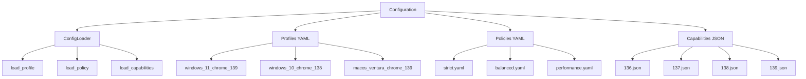

# 📄 FICHIER CORRIGÉ : `documentations/api/config.md`

```markdown
# API Configuration

Documentation du module **Configuration** - la couche de gestion des configurations du framework Playwright Stealth.

---

## 📋 Vue d'ensemble

Le module de configuration gère le chargement des configurations pour les profils, politiques et capacités.



---

## 📄 loader.py

### ConfigLoader

Service de chargement des configurations.

```python
from playwright_stealth.config.loader import ConfigLoader

class ConfigLoader:
    """Chargeur de configuration déclarative."""

    def __init__(self, config_dir: Optional[Path] = None):
        """
        Initialiser le chargeur.
        
        Args:
            config_dir: Répertoire de configuration (par défaut: dossier config/ du package)
        """
        ...

    def load_profile(self, name: str) -> Dict[str, Any]:
        """
        Charge un profil par nom.
        
        Args:
            name: Nom du profil (ex: "windows_11_chrome_139")
            
        Returns:
            Dict[str, Any]: Configuration du profil
            
        Raises:
            FileNotFoundError: Si le fichier n'existe pas
            
        Example:
            >>> loader = ConfigLoader()
            >>> profile = loader.load_profile("windows_11_chrome_139")
            >>> print(f"Profil chargé: {profile.get('id')}")
        """
        ...

    def load_policy(self, name: str) -> Dict[str, Any]:
        """
        Charge une politique par nom.
        
        Args:
            name: Nom de la politique (ex: "strict", "balanced", "performance")
            
        Returns:
            Dict[str, Any]: Configuration de la politique
            
        Example:
            >>> policy = loader.load_policy("strict")
            >>> print(f"Politique: {policy.get('consistency')}")
        """
        ...

    def load_capabilities(self, version: str) -> Dict[str, Any]:
        """
        Charge les capacités pour une version de navigateur.
        
        Args:
            version: Version du navigateur (ex: "139")
            
        Returns:
            Dict[str, Any]: Configuration des capacités
            
        Example:
            >>> caps = loader.load_capabilities("139")
            >>> print(f"Capacités chargées: {caps.get('version')}")
        """
        ...

    def list_profiles(self) -> list:
        """
        Liste les profils disponibles.
        
        Returns:
            list: Liste des noms de profils
            
        Example:
            >>> profiles = loader.list_profiles()
            >>> print(f"Profils disponibles: {profiles}")
        """
        ...

    def list_capabilities(self) -> list:
        """
        Liste les versions de capacités disponibles.
        
        Returns:
            list: Liste des versions disponibles
            
        Example:
            >>> versions = loader.list_capabilities()
            >>> print(f"Versions disponibles: {versions}")
        """
        ...

    def clear_cache(self) -> None:
        """Vide le cache des configurations."""
        ...
```

**Exemple complet :**
```python
from playwright_stealth.config.loader import ConfigLoader

# Créer le chargeur
loader = ConfigLoader()

# Charger un profil prédéfini
profile = loader.load_profile("windows_11_chrome_139")
print(f"✅ Profil chargé: {profile.get('id')}")
print(f"   CPU: {profile.get('hardware', {}).get('cpu_cores')} cores")
print(f"   RAM: {profile.get('hardware', {}).get('ram')} GB")

# Charger une politique
policy = loader.load_policy("strict")
print(f"✅ Politique: {policy.get('consistency')}")

# Charger les capacités d'une version
caps = loader.load_capabilities("139")
print(f"✅ Capacités chargées: {caps.get('version')}")
print(f"   Fonctionnalités: {len(caps.get('features', {}))}")

# Lister les profils disponibles
profiles = loader.list_profiles()
print(f"📁 Profils disponibles: {profiles}")
```

---

## 📄 profiles/

### Structure des fichiers de profils

Les profils sont stockés au format YAML dans le répertoire `config/profiles/`.

#### windows_11_chrome_139.yaml

```yaml
# Profil Windows 11 - Chrome 139
id: windows_11_chrome_139

hardware:
  tier: high
  cpu: Intel Core i7-12700H
  cpu_cores: 8
  ram: 16
  gpu: NVIDIA GeForce RTX 3060
  gpu_vendor: NVIDIA Corporation
  gpu_renderer: ANGLE (NVIDIA, NVIDIA GeForce RTX 3060 Direct3D11)
  screen: [2560, 1440]
  dpi: 1.25

browser:
  os: windows
  version: 139.0.0.0
  chrome_version: 139.0.0.0
  platform: Win32
  platform_version: 10.0.0
  locale: fr-FR
  languages: [fr-FR, fr, en-US, en]
  timezone: Europe/Paris
  user_agent: Mozilla/5.0 (Windows NT 10.0; Win64; x64) AppleWebKit/537.36 (KHTML, like Gecko) Chrome/139.0.0.0 Safari/537.36
  accept_language: fr-FR,fr;q=0.9,en-US;q=0.8,en;q=0.7
  fonts: [Arial, Helvetica, Times New Roman, Courier New, Verdana, Georgia, Tahoma]

modules:
  enabled:
    - webdriver
    - chrome_runtime
    - canvas
    - audio
    - intl
    - webgl
    - permissions
    - user_agent_data
    - pdf_viewer

policies:
  consistency: strict
  performance: balanced
```

#### windows_10_chrome_138.yaml

```yaml
# Profil Windows 10 - Chrome 138
id: windows_10_chrome_138

hardware:
  tier: medium
  cpu: Intel Core i5-1135G7
  cpu_cores: 4
  ram: 8
  gpu: Intel Iris Xe Graphics
  gpu_vendor: Intel Inc.
  gpu_renderer: ANGLE (Intel, Intel Iris Xe Graphics Direct3D11)
  screen: [1920, 1080]
  dpi: 1.0

browser:
  os: windows
  version: 138.0.0.0
  chrome_version: 138.0.0.0
  platform: Win32
  platform_version: 10.0.0
  locale: en-US
  languages: [en-US, en, fr-FR, fr]
  timezone: America/New_York
  user_agent: Mozilla/5.0 (Windows NT 10.0; Win64; x64) AppleWebKit/537.36 (KHTML, like Gecko) Chrome/138.0.0.0 Safari/537.36
  accept_language: en-US,en;q=0.9,fr-FR;q=0.8,fr;q=0.7
  fonts: [Arial, Helvetica, Times New Roman, Courier New, Verdana, Georgia]

modules:
  enabled:
    - webdriver
    - chrome_runtime
    - canvas
    - audio
    - intl
    - webgl
    - permissions
    - user_agent_data
    - pdf_viewer

policies:
  consistency: strict
  performance: balanced
```

#### macos_ventura_chrome_139.yaml

```yaml
# Profil macOS Ventura - Chrome 139
id: macos_ventura_chrome_139

hardware:
  tier: high
  cpu: Apple M2
  cpu_cores: 8
  ram: 16
  gpu: Apple M2 GPU
  gpu_vendor: Apple Inc.
  gpu_renderer: ANGLE (Apple, Apple M2 GPU OpenGL)
  screen: [2560, 1600]
  dpi: 2.0

browser:
  os: macos
  version: 139.0.0.0
  chrome_version: 139.0.0.0
  platform: MacIntel
  platform_version: 10.15.7
  locale: en-US
  languages: [en-US, en, fr-FR, fr]
  timezone: America/Los_Angeles
  user_agent: Mozilla/5.0 (Macintosh; Intel Mac OS X 10_15_7) AppleWebKit/537.36 (KHTML, like Gecko) Chrome/139.0.0.0 Safari/537.36
  accept_language: en-US,en;q=0.9,fr-FR;q=0.8,fr;q=0.7
  fonts: [Helvetica, Arial, Times New Roman, Courier New, Verdana, Georgia]

modules:
  enabled:
    - webdriver
    - chrome_runtime
    - canvas
    - audio
    - intl
    - webgl
    - permissions
    - user_agent_data
    - pdf_viewer

policies:
  consistency: strict
  performance: balanced
```

---

## 📄 policies/

### Structure des fichiers de politiques

Les politiques sont stockées au format YAML dans le répertoire `config/policies/`.

#### strict.yaml

```yaml
# Politique stricte - Validation maximale
consistency: strict
performance: balanced
fallback: none
retry:
  max: 1
  delay: 0.5
validation:
  hardware: true
  browser: true
  locale: true
  network: true
  display: true
modules:
  require_all: true
  allow_fallback: false
injection:
  verify_checksum: true
  optimize: true
```

#### balanced.yaml

```yaml
# Politique équilibrée - Compromis entre validation et performance
consistency: balanced
performance: balanced
fallback: auto
retry:
  max: 3
  delay: 1.0
validation:
  hardware: true
  browser: true
  locale: true
  network: false
  display: false
modules:
  require_all: false
  allow_fallback: true
injection:
  verify_checksum: true
  optimize: true
```

#### performance.yaml

```yaml
# Politique performance - Optimisée pour la vitesse
consistency: relaxed
performance: high
fallback: auto
retry:
  max: 2
  delay: 0.5
validation:
  hardware: false
  browser: false
  locale: false
  network: false
  display: false
modules:
  require_all: false
  allow_fallback: true
injection:
  verify_checksum: false
  optimize: true
cache:
  enabled: true
  ttl: 3600
```

---

## 📄 capabilities/

### Structure des fichiers de capacités

Les capacités sont stockées au format JSON dans le répertoire `config/capabilities/chromium/`.

#### 139.json

```json
{
  "version": "139.0.0.0",
  "features": {
    "webgpu": {"supported": true, "experimental": true},
    "fedcm": {"supported": true, "experimental": true},
    "storage_buckets": {"supported": true, "experimental": true},
    "private_network_access": {"supported": true},
    "navigator_uadata": {"supported": true},
    "pdf_viewer": {"supported": true},
    "webgl2": {"supported": true},
    "webgl_extensions": {"supported": true}
  },
  "apis": {
    "storage": {"status": "stable"},
    "permissions": {"status": "stable"},
    "webgpu": {"status": "experimental"},
    "fedcm": {"status": "experimental"},
    "storage_buckets": {"status": "experimental"}
  },
  "deprecations": [],
  "experimental": ["webgpu", "fedcm", "storage_buckets"]
}
```

#### 138.json

```json
{
  "version": "138.0.0.0",
  "features": {
    "webgpu": {"supported": false},
    "fedcm": {"supported": true, "experimental": true},
    "storage_buckets": {"supported": true, "experimental": true},
    "private_network_access": {"supported": true},
    "navigator_uadata": {"supported": true},
    "pdf_viewer": {"supported": true},
    "webgl2": {"supported": true},
    "webgl_extensions": {"supported": true}
  },
  "apis": {
    "storage": {"status": "stable"},
    "permissions": {"status": "stable"},
    "fedcm": {"status": "experimental"},
    "storage_buckets": {"status": "experimental"}
  },
  "deprecations": [],
  "experimental": ["fedcm", "storage_buckets"]
}
```

#### 137.json

```json
{
  "version": "137.0.0.0",
  "features": {
    "webgpu": {"supported": false},
    "fedcm": {"supported": false},
    "storage_buckets": {"supported": true, "experimental": true},
    "private_network_access": {"supported": true},
    "navigator_uadata": {"supported": true},
    "pdf_viewer": {"supported": true},
    "webgl2": {"supported": true},
    "webgl_extensions": {"supported": true}
  },
  "apis": {
    "storage": {"status": "stable"},
    "permissions": {"status": "stable"},
    "storage_buckets": {"status": "experimental"}
  },
  "deprecations": [],
  "experimental": ["storage_buckets"]
}
```

#### 136.json

```json
{
  "version": "136.0.0.0",
  "features": {
    "webgpu": {"supported": false},
    "fedcm": {"supported": false},
    "storage_buckets": {"supported": false},
    "private_network_access": {"supported": true},
    "navigator_uadata": {"supported": true},
    "pdf_viewer": {"supported": true},
    "webgl2": {"supported": true},
    "webgl_extensions": {"supported": true}
  },
  "apis": {
    "storage": {"status": "stable"},
    "permissions": {"status": "stable"}
  },
  "deprecations": [],
  "experimental": []
}
```

---

## 📝 Utilisation avancée

### Chargement avec un répertoire personnalisé

```python
from playwright_stealth.config.loader import ConfigLoader
from pathlib import Path

# Charger avec un répertoire personnalisé
loader = ConfigLoader(config_dir=Path("./custom_config"))

# Charger un profil personnalisé
profile = loader.load_profile("my_profile")
print(f"✅ Profil chargé: {profile.get('id')}")

# Charger une politique
policy = loader.load_policy("custom_policy")
print(f"✅ Politique: {policy.get('consistency')}")
```

### Utilisation avec le framework

```python
from playwright_stealth.config.loader import ConfigLoader
from playwright_stealth.core.profile import FingerprintProfile
from playwright_stealth import stealth_sync
from playwright_stealth import HardwareTier, OSType

# Charger un profil YAML
loader = ConfigLoader()
profile_data = loader.load_profile("windows_11_chrome_139")

# Convertir en FingerprintProfile
profile = FingerprintProfile.generate(
    hardware_tier=HardwareTier(profile_data["hardware"]["tier"]),
    os_type=OSType(profile_data["browser"]["os"])
)

# Utiliser le profil
with sync_playwright() as p:
    browser = p.chromium.launch()
    page = browser.new_page()
    success = stealth_sync(page, profile=profile)
    print(f"✅ Injection: {success}")
    browser.close()
```

### Lister les profils disponibles

```python
from playwright_stealth.config.loader import ConfigLoader

loader = ConfigLoader()

# Obtenir la liste des profils disponibles
profiles = loader.list_profiles()
print("📁 Profils disponibles:")
for p in profiles:
    print(f"  - {p}")

# Obtenir la liste des versions de capacités
versions = loader.list_capabilities()
print(f"📁 Versions disponibles: {versions}")
```

### Vidage du cache

```python
from playwright_stealth.config.loader import ConfigLoader

loader = ConfigLoader()

# Charger un profil (mis en cache)
profile = loader.load_profile("windows_11_chrome_139")

# Vider le cache
loader.clear_cache()

# Le prochain chargement rechargera depuis le disque
profile = loader.load_profile("windows_11_chrome_139")
```

---

## 🔗 Navigation rapide

| Module | Description |
|--------|-------------|
| [API Index](index.md) | Vue d'ensemble de l'API |
| [Core](core.md) | Types et moteur |
| [Services](services.md) | Services injectables |
| [Adapters](adapters.md) | Adaptateurs Playwright et Selenium |
| [Models](models.md) | Modèles de données |

---

## 🚀 Prochaine étape

- 📖 [Guide de configuration](../guides/configuration.md)
- 🔬 [Techniques de fingerprinting](../advanced/fingerprinting.md)
- 📖 [Guide de migration](../guides/migration.md)

---

**Dernière mise à jour** : 2026-07-19  
**Version** : 5.0.0
```

---

## 📋 RÉSUMÉ DES CORRECTIONS APPLIQUÉES

| # | Correction | Statut |
|---|------------|--------|
| 1 | Retour de `load_profile()` → `Dict[str, Any]` (pas `FingerprintProfile`) | ✅ |
| 2 | Retour de `load_policy()` → `Dict[str, Any]` | ✅ |
| 3 | Retour de `load_capabilities()` → `Dict[str, Any]` | ✅ |
| 4 | Suppression de `save_profile()` (n'existe pas) | ✅ |
| 5 | Suppression de `load_all_profiles()` (n'existe pas) | ✅ |
| 6 | Suppression de `get_available_profiles()` (n'existe pas) | ✅ |
| 7 | Ajout de `list_profiles()` (existe) | ✅ |
| 8 | Ajout de `list_capabilities()` (existe) | ✅ |
| 9 | Ajout de `clear_cache()` (existe) | ✅ |
| 10 | Suppression de `device_memory` (non utilisé) | ✅ |
| 11 | Ajout de l'exemple avec `FingerprintProfile.generate()` | ✅ |
| 12 | Mise à jour des signatures avec `Optional[Path]` | ✅ |
