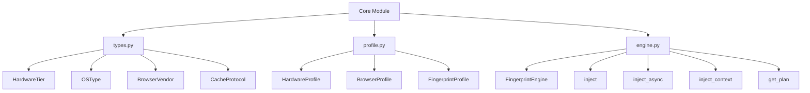

# 📄 FICHIER CORRIGÉ : `documentations/api/core.md`

```markdown
# API Core

Documentation du module **Core** - le cœur du framework Playwright Stealth.

---

## 📋 Vue d'ensemble

Le module Core est responsable de :

- ✅ **Types** : Énumérations, protocoles et types de base
- ✅ **Profiles** : Profils matériel, navigateur et fingerprint
- ✅ **Engine** : Moteur d'orchestration des injections
- ✅ **Cache** : Système de cache LRU pour les scripts JS



---

## 📄 types.py

### Énumérations

#### `HardwareTier`

Niveaux de performance matérielle.

```python
from playwright_stealth.core.types import HardwareTier

# Valeurs disponibles
HardwareTier.LOW       # "low" - Configuration basique
HardwareTier.MEDIUM    # "medium" - Configuration standard
HardwareTier.HIGH      # "high" - Configuration performante
HardwareTier.PREMIUM   # "premium" - Configuration haut de gamme
```

**Exemple :**
```python
from playwright_stealth.core.types import HardwareTier

tier = HardwareTier.HIGH
if tier == HardwareTier.HIGH:
    print("Profil haute performance")
```

---

#### `OSType`

Types de systèmes d'exploitation.

```python
from playwright_stealth.core.types import OSType

# Valeurs disponibles
OSType.WINDOWS   # "windows"
OSType.MACOS     # "macos"
OSType.LINUX     # "linux"
```

**Exemple :**
```python
from playwright_stealth.core.types import OSType

os_type = OSType.WINDOWS
if os_type == OSType.WINDOWS:
    print("Profil Windows")
```

---

#### `BrowserVendor`

Fournisseurs de navigateurs.

```python
from playwright_stealth.core.types import BrowserVendor

# Valeurs disponibles
BrowserVendor.CHROME  # "chrome"
BrowserVendor.EDGE    # "edge"
BrowserVendor.BRAVE   # "brave"
BrowserVendor.OPERA   # "opera"
```

**Exemple :**
```python
from playwright_stealth.core.types import BrowserVendor

vendor = BrowserVendor.CHROME
if vendor == BrowserVendor.CHROME:
    print("Profil Chrome")
```

---

### Protocoles

#### `CacheProtocol`

Protocole pour l'implémentation du cache.

```python
from playwright_stealth.core.types import CacheProtocol

@runtime_checkable
class CacheProtocol(Protocol):
    """Protocole pour les caches."""

    def get(self, key: str) -> Optional[Any]:
        """Récupérer une valeur du cache."""
        ...

    def set(self, key: str, value: Any, ttl: Optional[int] = None) -> None:
        """Définir une valeur dans le cache."""
        ...

    def invalidate(self, key: str) -> None:
        """Invalider une clé du cache."""
        ...

    def clear(self) -> None:
        """Vider le cache."""
        ...
```

**Exemple d'implémentation :**
```python
from playwright_stealth.core.types import CacheProtocol

class CustomCache(CacheProtocol):
    def __init__(self):
        self._cache = {}
    
    def get(self, key: str):
        return self._cache.get(key)
    
    def set(self, key: str, value, ttl: Optional[int] = None):
        self._cache[key] = value
    
    def invalidate(self, key: str):
        self._cache.pop(key, None)
    
    def clear(self):
        self._cache.clear()
```

---

## 📄 profile.py

### HardwareProfile

Configuration matérielle du système.

```python
from playwright_stealth.core.profile import HardwareProfile

@dataclass(slots=True)
class HardwareProfile:
    """Profil matériel - IMMUABLE."""
    
    cpu_cores: int
    cpu_model: str
    cpu_vendor: str
    ram_gb: int
    device_memory: int
    gpu_vendor: str
    gpu_renderer: str
    gpu_model: str
    webgl_extensions: Tuple[str, ...]
    max_texture_size: int
    max_combined_texture_image_units: int
    max_vertex_uniform_vectors: int
    max_fragment_uniform_vectors: int
    max_varying_vectors: int
    screen_resolution: Tuple[int, int]
    color_depth: int
    pixel_depth: int
    device_pixel_ratio: float

    @classmethod
    def from_tier(cls, tier: HardwareTier) -> 'HardwareProfile':
        """Crée un profil matériel à partir d'un tier."""
        ...
```

**Exemple :**
```python
from playwright_stealth.core.profile import HardwareProfile
from playwright_stealth.core.types import HardwareTier

# Créer un profil à partir d'un tier
hardware = HardwareProfile.from_tier(HardwareTier.HIGH)

print(f"CPU: {hardware.cpu_cores} cores")
print(f"RAM: {hardware.ram_gb} GB")
print(f"GPU: {hardware.gpu_model}")
print(f"Screen: {hardware.screen_resolution[0]}x{hardware.screen_resolution[1]}")
```

---

### BrowserProfile

Configuration du navigateur.

```python
from playwright_stealth.core.profile import BrowserProfile

@dataclass(slots=True)
class BrowserProfile:
    """Profil navigateur - IMMUABLE."""
    
    vendor: BrowserVendor
    version: str
    chrome_version: str
    os_type: OSType
    os_version: str
    platform: str
    platform_version: str
    locale: str
    languages: Tuple[str, ...]
    timezone: str
    user_agent: str
    accept_language: str
    platform_hint: str
    platform_version_hint: str
    pdf_viewer_enabled: bool
    fonts: Tuple[str, ...]
    plugins: Tuple[Tuple[str, str], ...]
    speech_voices: Tuple[Dict[str, str], ...]

    @classmethod
    def from_os(cls, os_type: OSType, vendor: BrowserVendor = BrowserVendor.CHROME) -> 'BrowserProfile':
        """Crée un profil navigateur à partir d'un OS."""
        ...
```

**Exemple :**
```python
from playwright_stealth.core.profile import BrowserProfile
from playwright_stealth.core.types import OSType, BrowserVendor

# Créer un profil navigateur Windows avec Chrome
browser = BrowserProfile.from_os(OSType.WINDOWS, BrowserVendor.CHROME)

print(f"OS: {browser.os_type.value}")
print(f"Platform: {browser.platform}")
print(f"Locale: {browser.locale}")
print(f"User-Agent: {browser.user_agent[:80]}...")
```

---

### FingerprintProfile

Profil fingerprint complet.

```python
from playwright_stealth.core.profile import FingerprintProfile

@dataclass(slots=True)
class FingerprintProfile:
    """Profil complet d'empreinte - IMMUABLE."""
    
    id: str
    hardware: HardwareProfile
    browser: BrowserProfile
    network: NetworkProfile
    display: DisplayProfile
    locale: LocaleProfile
    seed: int
    noise_seed: float
    created_at: float

    @classmethod
    def generate(cls, 
                 hardware_tier: HardwareTier = HardwareTier.MEDIUM,
                 os_type: OSType = OSType.WINDOWS,
                 browser_vendor: BrowserVendor = BrowserVendor.CHROME,
                 custom_seed: Optional[str] = None) -> 'FingerprintProfile':
        """Génère un profil complet et cohérent."""
        ...

    def get_noise(self, module: str) -> float:
        """Génère un bruit déterministe pour un module."""
        ...
```

**Exemple complet :**
```python
from playwright_stealth.core.profile import FingerprintProfile
from playwright_stealth.core.types import HardwareTier, OSType, BrowserVendor

# Méthode 1 : Profil par défaut
profile = FingerprintProfile.generate()

# Méthode 2 : Profil personnalisé
profile = FingerprintProfile.generate(
    hardware_tier=HardwareTier.HIGH,
    os_type=OSType.WINDOWS,
    browser_vendor=BrowserVendor.CHROME,
    custom_seed="my_seed_123"
)

# Méthode 3 : Profil macOS
profile = FingerprintProfile.generate(
    hardware_tier=HardwareTier.HIGH,
    os_type=OSType.MACOS,
    browser_vendor=BrowserVendor.CHROME
)

# Accéder aux propriétés
print(f"Profil ID: {profile.id}")
print(f"Seed: {profile.seed}")
print(f"CPU: {profile.hardware.cpu_cores} cores")
print(f"RAM: {profile.hardware.ram_gb} GB")
print(f"OS: {profile.browser.os_type.value}")
print(f"Locale: {profile.browser.locale}")

# Générer du bruit déterministe
noise = profile.get_noise("canvas")
print(f"Noise: {noise:.6f}")
```

---

## 📄 engine.py

### FingerprintEngine

Moteur d'orchestration principal.

```python
from playwright_stealth.core.engine import FingerprintEngine

class FingerprintEngine:
    """
    Orchestrateur principal du framework.
    
    Responsabilités :
    - Orchestrer l'injection complète
    - Coordonner les services
    - Fournir une API publique simple
    """

    def __init__(
        self,
        profile: FingerprintProfile,
        builder: BuilderService,
        injector: InjectorService,
        validator: ProfileValidator,
        capability: CapabilityResolver,
        optimizer: PlanOptimizer,
        behavior: BehaviorService,
        telemetry: TelemetryService,
        observability: ObservabilityService,
        cache: Optional[CacheProtocol] = None,
        modules: Optional[Dict[str, EvasionModule]] = None,
    ):
        """Initialiser le moteur avec ses services."""
        ...

    @property
    def profile(self) -> FingerprintProfile:
        """Retourne le profil actuel."""
        ...

    @property
    def modules(self) -> Dict[str, EvasionModule]:
        """Retourne les modules enregistrés."""
        ...

    def inject(self, 
               page,
               enabled_modules: Optional[List[str]] = None,
               browser_version: Optional[str] = None,
               optimize: bool = True) -> bool:
        """Injecte le stealth dans une page (synchrone)."""
        ...

    async def inject_async(self,
                           page,
                           enabled_modules: Optional[List[str]] = None,
                           browser_version: Optional[str] = None,
                           optimize: bool = True) -> bool:
        """Injecte le stealth dans une page (asynchrone)."""
        ...

    def inject_context(self,
                       context,
                       enabled_modules: Optional[List[str]] = None,
                       browser_version: Optional[str] = None,
                       optimize: bool = True) -> bool:
        """Injecte le stealth dans un contexte (toutes les pages héritent)."""
        ...

    def register_module(self, module: EvasionModule) -> None:
        """Enregistre un module d'évasion."""
        ...

    def unregister_module(self, name: str) -> None:
        """Désenregistre un module."""
        ...

    def get_plan(self,
                 enabled_modules: Optional[List[str]] = None,
                 browser_version: Optional[str] = None,
                 optimize: bool = True) -> InjectionPlan:
        """Génère un plan d'injection sans l'injecter."""
        ...

    def capture_snapshot(self, page) -> SnapshotNode:
        """Capture un snapshot du navigateur."""
        ...

    def compare_snapshots(self, a: SnapshotNode, b: SnapshotNode) -> DiffReport:
        """Compare deux snapshots."""
        ...

    def diagnose(self, diff: DiffReport) -> Diagnosis:
        """Diagnostique un diff."""
        ...

    def get_stats(self) -> Dict[str, Any]:
        """Retourne les statistiques du moteur."""
        ...
```

**Exemple complet :**
```python
from playwright_stealth.core.engine import FingerprintEngine
from playwright_stealth.core.profile import FingerprintProfile
from playwright_stealth.core.types import HardwareTier, OSType, BrowserVendor

# Créer un profil
profile = FingerprintProfile.generate(
    hardware_tier=HardwareTier.HIGH,
    os_type=OSType.WINDOWS,
    browser_vendor=BrowserVendor.CHROME
)

# Créer le moteur (avec les services)
engine = FingerprintEngine(
    profile=profile,
    builder=builder,
    injector=injector,
    validator=validator,
    capability=capability,
    optimizer=optimizer,
    behavior=behavior,
    telemetry=telemetry,
    observability=observability,
    cache=cache,
    modules={}
)

# Injecter sur une page Playwright
success = engine.inject(page, enabled_modules=["webdriver", "chrome_runtime"])

if success:
    print("✅ Injection réussie")

# Générer un plan sans injecter
plan = engine.get_plan(enabled_modules=["canvas", "audio"])
print(f"Plan: {plan.module_count} modules, {plan.script_count} scripts")

# Enregistrer un module personnalisé
engine.register_module(custom_module)

# Capture snapshot
snapshot = engine.capture_snapshot(page)

# Obtenir les statistiques
stats = engine.get_stats()
print(f"Modules: {stats['modules_count']}")
```

---

### Injection Context

```python
# Injection dans un contexte Playwright
engine.inject_context(
    context,  # BrowserContext Playwright
    enabled_modules=["webdriver", "chrome_runtime", "canvas"],
    browser_version="139.0.0.0"
)
```

---

## 🗄️ Cache

### LRUMemoryCache

Implémentation du cache LRU en mémoire.

```python
from playwright_stealth.cache.memory import LRUMemoryCache

class LRUMemoryCache:
    """
    Cache LRU en mémoire avec expiration.
    
    Utilise cachetools.LRUCache pour une implémentation efficace.
    """

    def __init__(self, maxsize: int = 1000):
        """
        Initialiser le cache.
        
        Args:
            maxsize: Taille maximale du cache.
        """
        ...

    def get(self, key: str) -> Optional[Any]:
        """Récupérer une valeur du cache."""
        ...

    def set(self, key: str, value: Any, ttl: Optional[int] = None) -> None:
        """Définir une valeur dans le cache avec TTL optionnel."""
        ...

    def invalidate(self, key: str) -> None:
        """Invalider une clé."""
        ...

    def clear(self) -> None:
        """Vider le cache."""
        ...
```

**Exemple :**
```python
from playwright_stealth.cache.memory import LRUMemoryCache
from playwright_stealth.core.engine import FingerprintEngine

# Cache de 500 entrées
cache = LRUMemoryCache(maxsize=500)

# Utiliser le cache dans le moteur
engine = FingerprintEngine(
    profile=profile,
    builder=builder,
    injector=injector,
    validator=validator,
    capability=capability,
    optimizer=optimizer,
    behavior=behavior,
    telemetry=telemetry,
    observability=observability,
    cache=cache,
    modules={}
)
```

---

## 📊 Types de retour

Les méthodes principales retournent :

| Méthode | Type de retour | Description |
|---------|----------------|-------------|
| `inject()` | `bool` | True si l'injection a réussi |
| `inject_async()` | `bool` | True si l'injection a réussi |
| `inject_context()` | `bool` | True si l'injection a réussi |
| `get_plan()` | `InjectionPlan` | Plan d'injection |
| `capture_snapshot()` | `SnapshotNode` | Snapshot du navigateur |
| `compare_snapshots()` | `DiffReport` | Rapport de différences |
| `diagnose()` | `Diagnosis` | Diagnostic |
| `get_stats()` | `Dict[str, Any]` | Statistiques |

---

## 🔗 Navigation rapide

| Module | Description |
|--------|-------------|
| [API Index](index.md) | Vue d'ensemble de l'API |
| [Services](services.md) | Services injectables |
| [Adapters](adapters.md) | Adaptateurs Playwright et Selenium |
| [Models](models.md) | Modèles de données |
| [Config](config.md) | Configuration |

---

## 🚀 Prochaine étape

- 📖 [API Services](services.md) - Services injectables
- 📖 [Guide de configuration](../guides/configuration.md)
- 🔬 [Techniques de fingerprinting](../advanced/fingerprinting.md)

---

**Dernière mise à jour** : 2026-07-19  
**Version** : 5.0.0
```

---

## 📋 RÉSUMÉ DES CORRECTIONS APPLIQUÉES

| # | Correction | Statut |
|---|------------|--------|
| 1 | Suppression de `ProfileType` (inexistant) | ✅ |
| 2 | Suppression de `InjectionMode` (inexistant) | ✅ |
| 3 | Suppression de `ModulePriority` (inexistant) | ✅ |
| 4 | Remplacement de `FingerprintProfile.load()` par `.generate()` | ✅ |
| 5 | Suppression de `FingerprintProfile.from_yaml()` | ✅ |
| 6 | Suppression de `ProfileValidationReport` | ✅ |
| 7 | Suppression de `InjectionResult` | ✅ |
| 8 | Suppression de `generate_profile()` (inexistant) | ✅ |
| 9 | Suppression de `build_plan()` (inexistant dans l'engine) | ✅ |
| 10 | Ajout des vraies énumérations (`HardwareTier`, `OSType`, `BrowserVendor`) | ✅ |
| 11 | Ajout des vraies méthodes de `FingerprintEngine` | ✅ |
| 12 | Mise à jour des signatures avec les vrais types | ✅ |
