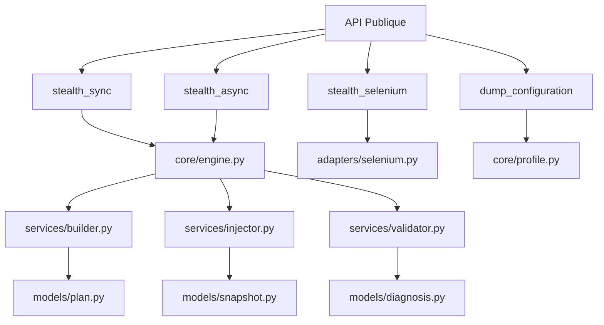

# 📄 FICHIER CORRIGÉ : `documentations/api/index.md`

```markdown
# API Reference

Bienvenue dans la référence complète de l'API du framework Playwright Stealth.

---

## 📋 Vue d'ensemble

L'API est organisée en plusieurs modules, chacun ayant une responsabilité spécifique :



---

## 🏗️ Architecture des modules

| Module | Description | Documentation |
|--------|-------------|---------------|
| **Core** | Moteur principal, types et profils | [core.md](core.md) |
| **Services** | Services injectables (Builder, Injector, Validator) | [services.md](services.md) |
| **Adapters** | Adaptateurs Playwright et Selenium | [adapters.md](adapters.md) |
| **Models** | Modèles de données (Plan, Snapshot, Diagnosis) | [models.md](models.md) |
| **Config** | Configuration des profils, politiques et capacités | [config.md](config.md) |
| **Cache** | Système de cache LRU pour les scripts JS | [core.md](core.md#cache) |

---

## 🎯 API Publique

### Fonctions principales

#### `stealth_sync(page, hardware_tier=None, os_type=None, browser_vendor=None, enabled_modules=None, browser_version=None, custom_seed=None)`

Appliquer la couche stealth sur une page Playwright (mode synchrone).

**Paramètres :**

| Paramètre | Type | Description | Défaut |
|-----------|------|-------------|--------|
| `page` | `playwright.sync_api.Page` | Page Playwright | Requis |
| `hardware_tier` | `HardwareTier` | Niveau de performance matérielle | `HardwareTier.MEDIUM` |
| `os_type` | `OSType` | Type de système d'exploitation | `OSType.WINDOWS` |
| `browser_vendor` | `BrowserVendor` | Fournisseur du navigateur | `BrowserVendor.CHROME` |
| `enabled_modules` | `Optional[List[str]]` | Modules à activer | `None` (tous) |
| `browser_version` | `Optional[str]` | Version du navigateur | `None` (dernière) |
| `custom_seed` | `Optional[str]` | Seed personnalisée | `None` |

**Retourne :** `bool` - True si l'injection a réussi

**Exemple :**
```python
from playwright.sync_api import sync_playwright
from playwright_stealth import stealth_sync
from playwright_stealth import HardwareTier, OSType

with sync_playwright() as p:
    browser = p.chromium.launch()
    page = browser.new_page()
    
    success = stealth_sync(
        page,
        hardware_tier=HardwareTier.HIGH,
        os_type=OSType.WINDOWS
    )
    
    if success:
        print("✅ Injection réussie")
    
    browser.close()
```

---

#### `stealth_async(page, hardware_tier=None, os_type=None, browser_vendor=None, enabled_modules=None, browser_version=None, custom_seed=None)`

Appliquer la couche stealth sur une page Playwright (mode asynchrone).

**Paramètres :**

| Paramètre | Type | Description | Défaut |
|-----------|------|-------------|--------|
| `page` | `playwright.async_api.Page` | Page Playwright | Requis |
| `hardware_tier` | `HardwareTier` | Niveau de performance matérielle | `HardwareTier.MEDIUM` |
| `os_type` | `OSType` | Type de système d'exploitation | `OSType.WINDOWS` |
| `browser_vendor` | `BrowserVendor` | Fournisseur du navigateur | `BrowserVendor.CHROME` |
| `enabled_modules` | `Optional[List[str]]` | Modules à activer | `None` (tous) |
| `browser_version` | `Optional[str]` | Version du navigateur | `None` (dernière) |
| `custom_seed` | `Optional[str]` | Seed personnalisée | `None` |

**Retourne :** `bool` - True si l'injection a réussi

**Exemple :**
```python
import asyncio
from playwright.async_api import async_playwright
from playwright_stealth import stealth_async
from playwright_stealth import HardwareTier, OSType

async def main():
    async with async_playwright() as p:
        browser = await p.chromium.launch()
        page = await browser.new_page()
        
        success = await stealth_async(
            page,
            hardware_tier=HardwareTier.HIGH,
            os_type=OSType.WINDOWS
        )
        
        if success:
            print("✅ Injection réussie")
        
        await browser.close()

asyncio.run(main())
```

---

#### `stealth_selenium(driver, hardware_tier=None, os_type=None, browser_vendor=None, enabled_modules=None, browser_version=None, custom_seed=None, use_cdp=True)`

Appliquer la couche stealth sur un driver Selenium.

**Paramètres :**

| Paramètre | Type | Description | Défaut |
|-----------|------|-------------|--------|
| `driver` | `selenium.webdriver` | Driver Selenium | Requis |
| `hardware_tier` | `HardwareTier` | Niveau de performance matérielle | `HardwareTier.MEDIUM` |
| `os_type` | `OSType` | Type de système d'exploitation | `OSType.WINDOWS` |
| `browser_vendor` | `BrowserVendor` | Fournisseur du navigateur | `BrowserVendor.CHROME` |
| `enabled_modules` | `Optional[List[str]]` | Modules à activer | `None` (tous) |
| `browser_version` | `Optional[str]` | Version du navigateur | `None` (dernière) |
| `custom_seed` | `Optional[str]` | Seed personnalisée | `None` |
| `use_cdp` | `bool` | Utiliser CDP (recommandé) | `True` |

**Retourne :** `bool` - True si l'injection a réussi

**Exemple :**
```python
from selenium import webdriver
from playwright_stealth import stealth_selenium
from playwright_stealth import HardwareTier, OSType

driver = webdriver.Chrome()

success = stealth_selenium(
    driver,
    hardware_tier=HardwareTier.HIGH,
    os_type=OSType.WINDOWS
)

if success:
    print("✅ Injection réussie")

driver.quit()
```

---

#### `dump_configuration(hardware_tier=None, os_type=None, browser_vendor=None)`

Afficher la configuration du framework.

**Paramètres :**

| Paramètre | Type | Description | Défaut |
|-----------|------|-------------|--------|
| `hardware_tier` | `HardwareTier` | Niveau de performance matérielle | `HardwareTier.MEDIUM` |
| `os_type` | `OSType` | Type de système d'exploitation | `OSType.WINDOWS` |
| `browser_vendor` | `BrowserVendor` | Fournisseur du navigateur | `BrowserVendor.CHROME` |

**Retourne :** `None` (affiche dans la console)

**Exemple :**
```python
from playwright_stealth import dump_configuration
from playwright_stealth import HardwareTier, OSType

dump_configuration(
    hardware_tier=HardwareTier.HIGH,
    os_type=OSType.WINDOWS
)

# Affiche :
# ============================================================
# 🛡️ STEALTH CONFIGURATION
# ============================================================
# 📌 Profil ID: e01377f7275b3204
# 📌 HARDWARE:
# CPU: 8 cores (Intel Core i7-12700H)
# RAM: 16 GB
# ...
```

---

## 📊 Types de retour

Les fonctions principales retournent :

| Fonction | Type de retour | Description |
|----------|----------------|-------------|
| `stealth_sync()` | `bool` | True si l'injection a réussi |
| `stealth_async()` | `bool` | True si l'injection a réussi |
| `stealth_selenium()` | `bool` | True si l'injection a réussi |
| `dump_configuration()` | `None` | Affiche dans la console |

---

## 🔧 Gestion des erreurs

### Exceptions principales

| Exception | Description |
|-----------|-------------|
| `FileNotFoundError` | Fichier de configuration introuvable |
| `ValueError` | Paramètre invalide |
| `ValidationError` | Échec de validation du profil |
| `TimeoutError` | Timeout dépassé |

### Gestion des erreurs recommandée

```python
from playwright_stealth import stealth_sync
from playwright_stealth import HardwareTier, OSType
from playwright_stealth.services.validator import ValidationError

try:
    success = stealth_sync(
        page,
        hardware_tier=HardwareTier.HIGH,
        os_type=OSType.WINDOWS
    )
    
    if success:
        print("✅ Injection réussie")
        
except ValidationError as e:
    print(f"❌ Erreur de validation : {e}")
    
except FileNotFoundError as e:
    print(f"❌ Fichier introuvable : {e}")
    
except ValueError as e:
    print(f"❌ Paramètre invalide : {e}")
    
except TimeoutError:
    print("⏰ Timeout dépassé, réessayer avec un timeout plus long")
    
except Exception as e:
    print(f"❌ Erreur : {e}")
```

---

## 📝 Exemples d'utilisation avancée

### Injection avec modules spécifiques

```python
from playwright_stealth import stealth_sync
from playwright_stealth import HardwareTier, OSType

# Activer uniquement certains modules
success = stealth_sync(
    page,
    hardware_tier=HardwareTier.HIGH,
    os_type=OSType.WINDOWS,
    enabled_modules=["webdriver", "chrome_runtime", "canvas"]
)

if success:
    print("✅ Modules sélectifs injectés")
```

### Injection pour macOS

```python
from playwright_stealth import stealth_sync
from playwright_stealth import HardwareTier, OSType

success = stealth_sync(
    page,
    hardware_tier=HardwareTier.HIGH,
    os_type=OSType.MACOS
)

if success:
    print("✅ Profil macOS appliqué")
```

### Injection avec cache personnalisé

```python
from playwright_stealth import stealth_sync
from playwright_stealth.cache.memory import LRUMemoryCache

# Cache de 1024 scripts
cache = LRUMemoryCache(maxsize=1024)

success = stealth_sync(page)

if success:
    print("✅ Injection avec cache")
```

---

## 🔗 Navigation rapide

| Module | Description |
|--------|-------------|
| [Core](core.md) | Types, profils, engine |
| [Services](services.md) | Builder, Injector, Validator |
| [Adapters](adapters.md) | Playwright, Selenium |
| [Models](models.md) | Plan, Snapshot, Diagnosis |
| [Config](config.md) | ConfigLoader, profils YAML |

---

## 🚀 Prochaine étape

- 📖 [API Core](core.md) - Types et moteur
- 📖 [API Services](services.md) - Services injectables
- 📖 [Guide de configuration](../guides/configuration.md)

---

**Dernière mise à jour** : 2026-07-19  
**Version** : 5.0.0
```

---

## 📋 RÉSUMÉ DES CORRECTIONS APPLIQUÉES

| # | Correction | Statut |
|---|------------|--------|
| 1 | Suppression de `generate_profile()` (inexistant) | ✅ |
| 2 | Suppression de `InjectionResult` (inexistant) | ✅ |
| 3 | Suppression des exceptions personnalisées (inexistantes) | ✅ |
| 4 | Correction de la signature de `stealth_sync()` | ✅ |
| 5 | Correction de la signature de `stealth_async()` | ✅ |
| 6 | Correction de la signature de `stealth_selenium()` | ✅ |
| 7 | Ajout de `dump_configuration()` | ✅ |
| 8 | Mise à jour des types de retour (`bool`) | ✅ |
| 9 | Mise à jour des paramètres (`hardware_tier`, `os_type`, `browser_vendor`, etc.) | ✅ |
| 10 | Simplification de la gestion des erreurs | ✅ |
| 11 | Mise à jour des exemples | ✅ |
