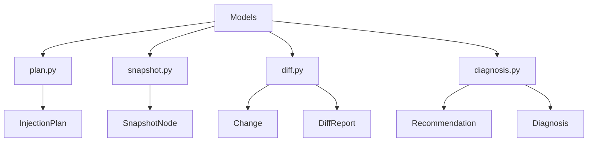

# 📄 FICHIER CORRIGÉ : `documentations/api/models.md`

```markdown
# API Models

Documentation des **Modèles de données** - la couche de représentation des données du framework Playwright Stealth.

---

## 📋 Vue d'ensemble

Les modèles de données sont les structures fondamentales utilisées par le framework pour représenter et manipuler les informations.



---

## 📄 plan.py

### InjectionPlan

Plan d'injection des modules d'évasion.

```python
from playwright_stealth.models.plan import InjectionPlan

@dataclass(slots=True)
class InjectionPlan:
    """
    Plan d'injection reproductible.
    
    Le checksum est calculé une fois à la construction
    pour garantir l'intégrité du plan.
    """
    profile_id: str
    modules: List[str]           # Liste des noms de modules
    scripts: List[str]           # Liste des scripts JS
    dependencies: Dict[str, List[str]]
    metadata: Dict[str, Any] = field(default_factory=dict)
    _checksum: Optional[str] = field(init=False, default=None)
    
    @property
    def checksum(self) -> str:
        """Retourne le checksum du plan - O(1)"""
        ...
    
    @property
    def script_count(self) -> int:
        """Nombre de scripts dans le plan"""
        ...
    
    @property
    def module_count(self) -> int:
        """Nombre de modules dans le plan"""
        ...
    
    def to_json(self) -> str:
        """Sérialise le plan en JSON"""
        ...
    
    def to_dict(self) -> Dict:
        """Convertit en dictionnaire"""
        ...
    
    @classmethod
    def from_json(cls, data: str) -> 'InjectionPlan':
        """Désérialise un plan depuis JSON"""
        ...
```

**Exemple :**
```python
from playwright_stealth.models.plan import InjectionPlan

# Créer un plan d'injection
plan = InjectionPlan(
    profile_id="profile_123",
    modules=["webdriver", "chrome_runtime", "canvas"],
    scripts=[
        "// WebDriver evasion script",
        "// Chrome runtime script",
        "// Canvas fingerprinting script"
    ],
    dependencies={
        "webdriver": [],
        "chrome_runtime": ["webdriver"],
        "canvas": []
    },
    metadata={"version": "5.0.0", "generated_by": "BuilderService"}
)

# Accéder aux propriétés
print(f"Plan ID: {plan.profile_id}")
print(f"Modules: {plan.modules}")
print(f"Scripts: {plan.script_count}")
print(f"Checksum: {plan.checksum}")

# Sérialiser
json_data = plan.to_json()
print(f"JSON: {json_data}")
```

---

## 📄 snapshot.py

### SnapshotNode

Représentation d'un snapshot du navigateur.

```python
from playwright_stealth.models.snapshot import SnapshotNode
from playwright_stealth.core.types import NodeType

@dataclass(slots=True)
class SnapshotNode:
    """
    Noeud de snapshot avec dictionnaire pour les enfants.
    Complexité O(1) pour les recherches.
    """
    name: str
    value: Any
    node_type: NodeType = NodeType.PROPERTY
    descriptor: Optional[Dict[str, Any]] = None
    children: Dict[str, 'SnapshotNode'] = field(default_factory=dict)
    parent: Optional['SnapshotNode'] = field(default=None, repr=False)
    
    def add_child(self, node: 'SnapshotNode') -> 'SnapshotNode':
        """Ajoute un enfant avec référence parent - O(1)"""
        ...
    
    def get_child(self, name: str) -> Optional['SnapshotNode']:
        """Récupère un enfant par son nom - O(1)"""
        ...
    
    def find(self, path: str) -> Optional['SnapshotNode']:
        """Trouve un noeud par chemin - O(1) par niveau"""
        ...
    
    def get_value(self, path: str, default: Any = None) -> Any:
        """Récupère la valeur d'un noeud par chemin"""
        ...
    
    def path(self) -> str:
        """Retourne le chemin complet - O(depth)"""
        ...
    
    def depth(self) -> int:
        """Retourne la profondeur - O(depth)"""
        ...
    
    def root(self) -> 'SnapshotNode':
        """Retourne le noeud racine - O(depth)"""
        ...
    
    def walk(self) -> List['SnapshotNode']:
        """Parcourt l'arborescence - O(n)"""
        ...
    
    def to_dict(self) -> Dict:
        """Convertit en dictionnaire"""
        ...
    
    def to_json(self, indent: int = 2) -> str:
        """Convertit en JSON"""
        ...
    
    @classmethod
    def from_dict(cls, data: Dict) -> 'SnapshotNode':
        """Crée un noeud à partir d'un dictionnaire"""
        ...
    
    @classmethod
    def from_json(cls, data: str) -> 'SnapshotNode':
        """Crée un noeud à partir de JSON"""
        ...
```

**Exemple :**
```python
from playwright_stealth.models.snapshot import SnapshotNode
from playwright_stealth.core.types import NodeType

# Créer un snapshot
root = SnapshotNode(
    name="page",
    value=None,
    node_type=NodeType.OBJECT
)

# Ajouter des noeuds enfants
navigator = SnapshotNode(
    name="navigator",
    value=None,
    node_type=NodeType.OBJECT
)
root.add_child(navigator)

# Ajouter des propriétés
user_agent = SnapshotNode(
    name="userAgent",
    value="Mozilla/5.0...",
    node_type=NodeType.PROPERTY
)
navigator.add_child(user_agent)

webgl = SnapshotNode(
    name="webgl",
    value=None,
    node_type=NodeType.OBJECT
)
root.add_child(webgl)

vendor = SnapshotNode(
    name="vendor",
    value="Intel Inc.",
    node_type=NodeType.PROPERTY
)
webgl.add_child(vendor)

# Rechercher un noeud
node = root.find("navigator.userAgent")
if node:
    print(f"User-Agent: {node.value}")

# Parcourir l'arbre
for node in root.walk():
    print(f"{node.path()}: {node.value}")
```

---

## 📄 diff.py

### Change et DiffReport

Modèles pour les différences entre snapshots.

```python
from playwright_stealth.models.diff import Change, DiffReport, ChangeType, ChangeSeverity

class ChangeType(Enum):
    """Type de changement dans un diff"""
    ADDED = "added"
    REMOVED = "removed"
    CHANGED = "changed"
    SAME = "same"


class ChangeSeverity(Enum):
    """Sévérité des changements détectés"""
    CRITICAL = "critical"
    HIGH = "high"
    MEDIUM = "medium"
    LOW = "low"
    INFO = "info"


@dataclass(slots=True)
class Change:
    """Un changement détecté dans un diff"""
    path: str
    type: ChangeType
    before: Optional[Any]
    after: Optional[Any]
    severity: Optional[ChangeSeverity] = None
    reason: Optional[str] = None
    suggestion: Optional[str] = None


@dataclass(slots=True)
class DiffReport:
    """Rapport de diff"""
    changes: List[Change] = field(default_factory=list)
    metadata: Dict[str, Any] = field(default_factory=dict)
    
    @property
    def total_changes(self) -> int:
        """Nombre total de changements"""
        ...
    
    @property
    def critical_count(self) -> int:
        """Nombre de changements critiques"""
        ...
    
    @property
    def high_count(self) -> int:
        """Nombre de changements haute priorité"""
        ...
    
    @property
    def medium_count(self) -> int:
        """Nombre de changements priorité moyenne"""
        ...
    
    @property
    def low_count(self) -> int:
        """Nombre de changements basse priorité"""
        ...
    
    def to_dict(self) -> Dict:
        """Convertit en dictionnaire"""
        ...
```

**Exemple :**
```python
from playwright_stealth.models.diff import Change, DiffReport, ChangeType, ChangeSeverity

# Créer des changements
change1 = Change(
    path="navigator.userAgent",
    type=ChangeType.CHANGED,
    before="Mozilla/5.0 (Windows NT 10.0...)",
    after="Mozilla/5.0 (Macintosh; Intel Mac OS X...)",
    severity=ChangeSeverity.HIGH,
    reason="User-Agent modifié",
    suggestion="Vérifier la cohérence avec la plateforme"
)

change2 = Change(
    path="webgl.vendor",
    type=ChangeType.ADDED,
    before=None,
    after="Intel Inc.",
    severity=ChangeSeverity.INFO
)

# Créer un rapport
report = DiffReport(changes=[change1, change2])
print(f"Total changements: {report.total_changes}")
print(f"Critiques: {report.critical_count}")
print(f"Hautes: {report.high_count}")

# Filtrer les changements critiques
critical_changes = [c for c in report.changes if c.severity == ChangeSeverity.HIGH]
for change in critical_changes:
    print(f"{change.path}: {change.before} → {change.after}")
    print(f"  Suggestion: {change.suggestion}")
```

---

## 📄 diagnosis.py

### Recommendation et Diagnosis

Modèles pour le diagnostic et les recommandations.

```python
from playwright_stealth.models.diagnosis import Recommendation, Diagnosis

@dataclass(slots=True)
class Recommendation:
    """Recommandation individuelle"""
    path: str
    severity: str  # 'critical', 'high', 'medium', 'low', 'info'
    reason: str
    suggestion: str
    before: Optional[Any] = None
    after: Optional[Any] = None
    affected_modules: List[str] = field(default_factory=list)
    metadata: Dict[str, Any] = field(default_factory=dict)


@dataclass(slots=True)
class Diagnosis:
    """Diagnostic complet"""
    total_issues: int
    critical: int
    high: int
    medium: int
    low: int
    recommendations: List[Recommendation] = field(default_factory=list)
    metadata: Dict[str, Any] = field(default_factory=dict)
    
    @property
    def has_issues(self) -> bool:
        """Vérifie s'il y a des problèmes"""
        ...
    
    @property
    def has_critical(self) -> bool:
        """Vérifie s'il y a des problèmes critiques"""
        ...
    
    @property
    def has_high(self) -> bool:
        """Vérifie s'il y a des problèmes haute priorité"""
        ...
    
    def to_dict(self) -> Dict:
        """Convertit en dictionnaire"""
        ...
    
    @classmethod
    def from_diff(cls, diff_report: DiffReport) -> 'Diagnosis':
        """Crée un diagnostic à partir d'un rapport de diff"""
        ...
```

**Exemple :**
```python
from playwright_stealth.models.diagnosis import Recommendation, Diagnosis
from playwright_stealth.models.diff import Change, DiffReport, ChangeType, ChangeSeverity

# Créer des recommandations
rec1 = Recommendation(
    path="hardware.deviceMemory",
    severity="high",
    reason="Device Memory (4GB) ne correspond pas à la RAM (32GB)",
    suggestion="Ajuster deviceMemory à 8GB ou plus",
    before=4,
    after=8,
    affected_modules=["navigator.deviceMemory"]
)

rec2 = Recommendation(
    path="intl.timezone",
    severity="critical",
    reason="Langue 'fr-FR' incohérente avec fuseau 'America/New_York'",
    suggestion="Utiliser 'Europe/Paris'",
    before="America/New_York",
    after="Europe/Paris",
    affected_modules=["intl"]
)

# Créer un diagnostic
diagnosis = Diagnosis(
    total_issues=2,
    critical=1,
    high=1,
    medium=0,
    low=0,
    recommendations=[rec1, rec2]
)

# Analyser le diagnostic
print(f"Total: {diagnosis.total_issues}")
print(f"Critiques: {diagnosis.critical}")
print(f"Haute priorité: {diagnosis.high}")

if diagnosis.has_critical:
    print("⚠️ Des problèmes critiques nécessitent une attention immédiate")

# Vérifier les recommandations
for rec in diagnosis.recommendations:
    print(f"\n[{rec.severity.upper()}] {rec.reason}")
    print(f"  Suggestion: {rec.suggestion}")
    print(f"  Modules affectés: {rec.affected_modules}")
```

---

## 🔗 Navigation rapide

| Module | Description |
|--------|-------------|
| [API Index](index.md) | Vue d'ensemble de l'API |
| [Core](core.md) | Types et moteur |
| [Services](services.md) | Services injectables |
| [Adapters](adapters.md) | Adaptateurs Playwright et Selenium |
| [Config](config.md) | Configuration |

---

## 🚀 Prochaine étape

- 📖 [API Config](config.md) - Configuration
- 📖 [Guide de configuration](../guides/configuration.md)
- 🔬 [Techniques de fingerprinting](../advanced/fingerprinting.md)

---

**Dernière mise à jour** : 2026-07-19  
**Version** : 5.0.0
```

---

## 📋 RÉSUMÉ DES CORRECTIONS APPLIQUÉES

| # | Correction | Statut |
|---|------------|--------|
| 1 | Suppression de `Module` comme classe exportée | ✅ |
| 2 | Suppression de `PlanStatus` comme classe | ✅ |
| 3 | Suppression de `SnapshotTree` et `SnapshotDiff` | ✅ |
| 4 | Suppression de `ConfigModel`, `PolicyModel`, `ProfileModel`, `CapabilityModel` | ✅ |
| 5 | Conservation des modèles réels (`InjectionPlan`, `SnapshotNode`, `Change`, `DiffReport`, `Recommendation`, `Diagnosis`) | ✅ |
| 6 | Correction des exemples pour refléter l'API réelle | ✅ |
| 7 | Mise à jour des signatures avec les vrais types | ✅ |
| 8 | Conservation des enum `ChangeType`, `ChangeSeverity` (existent dans le code) | ✅ |
