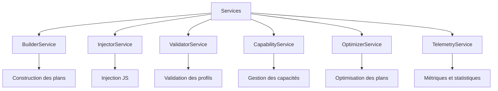

# 📄 FICHIER CORRIGÉ : `documentations/api/services.md`

```markdown
# API Services

Documentation des **Services** - couche fonctionnelle du framework Playwright Stealth.

---

## 📋 Vue d'ensemble

Les Services sont le moteur fonctionnel du framework. Chaque service a une responsabilité unique et est conçu pour être injectable et testable.



---

## 📄 builder.py

### BuilderService

Service de construction des plans d'injection.

```python
from playwright_stealth.services.builder import BuilderService

class BuilderService:
    """
    Service de construction des plans d'injection.
    
    Responsabilités :
    - Charger les scripts JS pour chaque module
    - Construire un plan d'injection complet
    - Gérer les dépendances entre modules
    """

    def __init__(self, loader: Optional[ScriptLoader] = None):
        """
        Initialiser le builder.
        
        Args:
            loader: Chargeur de scripts (ScriptLoader par défaut).
        """
        ...

    def build(
        self,
        modules: List[EvasionModule],
        profile: FingerprintProfile,
        context: Optional[Dict[str, Any]] = None
    ) -> InjectionPlan:
        """
        Construire un plan d'injection à partir des modules.
        
        Args:
            modules: Liste des modules à inclure.
            profile: Profil d'empreinte.
            context: Contexte additionnel.
            
        Returns:
            InjectionPlan: Plan d'injection complet.
        """
        ...

    def build_from_names(
        self,
        module_names: List[str],
        modules_registry: Dict[str, EvasionModule],
        profile: FingerprintProfile,
        context: Optional[Dict[str, Any]] = None
    ) -> InjectionPlan:
        """
        Construire un plan à partir des noms de modules.
        
        Args:
            module_names: Liste des noms de modules.
            modules_registry: Dictionnaire nom -> module.
            profile: Profil d'empreinte.
            context: Contexte additionnel.
            
        Returns:
            InjectionPlan: Plan d'injection complet.
        """
        ...

    def load_script(self, script_name: str) -> str:
        """
        Charger un script JS individuel.
        
        Args:
            script_name: Nom du script (sans extension).
            
        Returns:
            str: Contenu du script.
        """
        ...

    def clear_cache(self) -> None:
        """Vider le cache des scripts."""
        ...
```

**Exemple :**
```python
from playwright_stealth.services.builder import BuilderService
from playwright_stealth.core.profile import FingerprintProfile

# Créer le builder
builder = BuilderService()

# Créer un profil
profile = FingerprintProfile.generate()

# Construire un plan avec des modules
modules = [webdriver_module, chrome_runtime_module, canvas_module]
plan = builder.build(modules, profile)

# Construire un plan à partir des noms de modules
modules_registry = {
    "webdriver": webdriver_module,
    "chrome_runtime": chrome_runtime_module
}
plan = builder.build_from_names(
    ["webdriver", "chrome_runtime"],
    modules_registry,
    profile
)

# Charger un script individuel
script = builder.load_script("webdriver")
print(f"Script chargé: {len(script)} caractères")
```

---

## 📄 injector.py

### InjectorService

Service d'injection des scripts JavaScript.

```python
from playwright_stealth.services.injector import InjectorService

class InjectorService:
    """
    Service d'injection des scripts dans le navigateur.
    
    Responsabilités :
    - Injecter les scripts d'un plan dans une page
    - Gérer l'injection synchrone et asynchrone
    - Vérifier l'intégrité du plan avant injection
    """

    def __init__(self, telemetry: Optional[TelemetryService] = None):
        """
        Initialiser l'injecteur.
        
        Args:
            telemetry: Service de télémétrie.
        """
        ...

    def inject(self, page, plan: InjectionPlan, verify: bool = True) -> bool:
        """
        Injecter un plan dans une page (synchrone).
        
        Args:
            page: Page Playwright (sync).
            plan: Plan d'injection.
            verify: Vérifier l'intégrité du plan.
            
        Returns:
            bool: True si l'injection a réussi.
        """
        ...

    async def inject_async(self, page, plan: InjectionPlan, verify: bool = True) -> bool:
        """
        Injecter un plan dans une page (asynchrone).
        
        Args:
            page: Page Playwright (async).
            plan: Plan d'injection.
            verify: Vérifier l'intégrité du plan.
            
        Returns:
            bool: True si l'injection a réussi.
        """
        ...

    def inject_context(self, context, plan: InjectionPlan, verify: bool = True) -> bool:
        """
        Injecter un plan dans un contexte (toutes les pages héritent).
        
        Args:
            context: BrowserContext Playwright.
            plan: Plan d'injection.
            verify: Vérifier l'intégrité du plan.
            
        Returns:
            bool: True si l'injection a réussi.
        """
        ...
```

**Exemple :**
```python
from playwright_stealth.services.injector import InjectorService
from playwright_stealth.services.builder import BuilderService

# Créer les services
builder = BuilderService()
injector = InjectorService()

# Construire un plan
plan = builder.build(modules, profile)

# Injection synchrone
success = injector.inject(page, plan)
print(f"✅ Injection: {success}")

# Injection asynchrone
success = await injector.inject_async(page, plan)

# Injection sur un contexte
success = injector.inject_context(context, plan)
```

---

## 📄 validator.py

### ProfileValidator

Service de validation des profils.

```python
from playwright_stealth.services.validator import ProfileValidator, ValidationError

class ProfileValidator:
    """
    Validateur de profils d'empreinte.
    
    Responsabilités :
    - Vérifier la cohérence des données d'un profil
    - Détecter les incohérences matérielles et logicielles
    - Fournir des messages d'erreur détaillés
    """

    def __init__(self):
        """Initialiser le validateur."""
        ...

    def validate(self, profile: FingerprintProfile) -> List[str]:
        """
        Valider un profil et retourner la liste des incohérences.
        
        Args:
            profile: Profil à valider.
            
        Returns:
            List[str]: Liste des erreurs (vide si valide).
        """
        ...

    def validate_or_raise(self, profile: FingerprintProfile) -> bool:
        """
        Valider un profil et lever une exception en cas d'erreur.
        
        Args:
            profile: Profil à valider.
            
        Returns:
            bool: True si le profil est valide.
            
        Raises:
            ValidationError: En cas d'erreur de validation.
        """
        ...
```

**Exemple :**
```python
from playwright_stealth.services.validator import ProfileValidator, ValidationError

validator = ProfileValidator()

# Valider un profil
profile = FingerprintProfile.generate()
errors = validator.validate(profile)

if errors:
    print("⚠️ Problèmes détectés:")
    for error in errors:
        print(f"  - {error}")
else:
    print("✅ Profil valide")

# Valider avec exception
try:
    validator.validate_or_raise(profile)
    print("✅ Profil valide")
except ValidationError as e:
    print(f"❌ {e}")
```

---

## 📄 capability.py

### CapabilityResolver et CapabilityRegistry

Services de gestion des capacités des modules.

```python
from playwright_stealth.services.capability import (
    CapabilityResolver,
    CapabilityRegistry
)

@dataclass(slots=True)
class BrowserCapabilities:
    """Capabilités complètes d'une version de navigateur."""
    
    version: str
    features: Dict[str, FeatureCapability]
    apis: Dict[str, APICapability]
    deprecations: Set[str]
    experimental: Set[str]

    def supports(self, feature: str) -> bool:
        """Vérifier si une fonctionnalité est supportée."""
        ...

    def api_status(self, api: str) -> Optional[str]:
        """Retourner le statut d'une API."""
        ...


class CapabilityRegistry:
    """
    Registre des capacités par version.
    
    Responsabilités :
    - Charger les capacités depuis JSON
    - Gérer le cache des versions
    - Fournir la dernière version disponible
    """

    def __init__(self, data_dir: Optional[Path] = None):
        """
        Initialiser le registre.
        
        Args:
            data_dir: Répertoire des données de capacités.
        """
        ...

    def load(self, version: str) -> BrowserCapabilities:
        """
        Charger les capacités pour une version donnée.
        
        Args:
            version: Version du navigateur (ex: "139.0.0.0").
            
        Returns:
            BrowserCapabilities: Capabilités de la version.
            
        Raises:
            FileNotFoundError: Si le fichier n'existe pas.
        """
        ...

    def get_latest(self) -> BrowserCapabilities:
        """
        Récupérer les capacités de la dernière version disponible.
        
        Returns:
            BrowserCapabilities: Capabilités de la dernière version.
        """
        ...

    def clear_cache(self) -> None:
        """Vider le cache."""
        ...


class CapabilityResolver:
    """
    Résolveur de capacités pour les modules d'évasion.
    
    Responsabilités :
    - Filtrer les modules compatibles avec une version
    - Vérifier les prérequis des modules
    - Gérer les conflits entre modules
    """

    def __init__(self, registry: CapabilityRegistry):
        """
        Initialiser le résolveur.
        
        Args:
            registry: Registre des capacités.
        """
        ...

    def resolve(
        self,
        requested_modules: Optional[List[str]] = None,
        modules_registry: Optional[Dict[str, EvasionModule]] = None,
        browser_version: Optional[str] = None
    ) -> List[EvasionModule]:
        """
        Résoudre la liste des modules compatibles.
        
        Args:
            requested_modules: Noms des modules demandés (None = tous).
            modules_registry: Dictionnaire nom -> module.
            browser_version: Version du navigateur (None = dernière).
            
        Returns:
            List[EvasionModule]: Liste des modules compatibles.
        """
        ...

    def supports(self, feature: str, browser_version: Optional[str] = None) -> bool:
        """
        Vérifier si une fonctionnalité est supportée.
        
        Args:
            feature: Nom de la fonctionnalité.
            browser_version: Version du navigateur.
            
        Returns:
            bool: True si supportée.
        """
        ...

    def get_version_info(self, version: str) -> Dict[str, Any]:
        """
        Retourner des informations sur une version.
        
        Args:
            version: Version du navigateur.
            
        Returns:
            Dict[str, Any]: Informations de version.
        """
        ...
```

**Exemple :**
```python
from playwright_stealth.services.capability import (
    CapabilityRegistry,
    CapabilityResolver
)
from pathlib import Path

# Créer le registre
registry = CapabilityRegistry(data_dir=Path("config/capabilities"))

# Charger les capacités d'une version
caps = registry.load("139")
print(f"Version: {caps.version}")
print(f"Fonctionnalités: {len(caps.features)}")
print(f"APIs: {len(caps.apis)}")

# Créer le résolveur
resolver = CapabilityResolver(registry)

# Résoudre les modules compatibles
compatible = resolver.resolve(
    requested_modules=["webdriver", "canvas", "audio"],
    modules_registry=modules_registry,
    browser_version="139"
)
print(f"Modules compatibles: {len(compatible)}")

# Vérifier le support d'une fonctionnalité
supports_webgpu = resolver.supports("webgpu", "139")
print(f"WebGPU supporté: {supports_webgpu}")
```

---

## 📄 optimizer.py

### PlanOptimizer

Service d'optimisation des plans d'injection.

```python
from playwright_stealth.services.optimizer import PlanOptimizer

class PlanOptimizer:
    """
    Optimiseur de plans d'injection.
    
    Responsabilités :
    - Supprimer les doublons de scripts
    - Fusionner les scripts compatibles
    - Optimiser l'ordre d'exécution
    """

    def __init__(self):
        """Initialiser l'optimiseur."""
        ...

    def optimize(self, plan: InjectionPlan) -> InjectionPlan:
        """
        Optimiser un plan d'injection.
        
        Args:
            plan: Plan à optimiser.
            
        Returns:
            InjectionPlan: Plan optimisé.
        """
        ...

    def get_stats(self) -> Dict[str, Any]:
        """
        Retourner les statistiques d'optimisation.
        
        Returns:
            Dict[str, Any]: Statistiques.
        """
        ...

    def reset_stats(self) -> None:
        """Réinitialiser les statistiques d'optimisation."""
        ...
```

**Exemple :**
```python
from playwright_stealth.services.optimizer import PlanOptimizer

optimizer = PlanOptimizer()

# Optimiser un plan
optimized_plan = optimizer.optimize(plan)

# Vérifier les métriques d'optimisation
if optimized_plan.metadata.get("optimized", False):
    original = optimized_plan.metadata["original_size"]
    optimized = optimized_plan.metadata["optimized_size"]
    print(f"Original: {original} scripts")
    print(f"Optimisé: {optimized} scripts")
    print(f"Réduction: {original - optimized} scripts")

# Obtenir les statistiques
stats = optimizer.get_stats()
print(f"Optimisations effectuées: {stats['optimization_count']}")
```

---

## 📄 telemetry.py

### TelemetryService

Service de télémétrie pour les métriques et événements.

```python
from playwright_stealth.services.telemetry import TelemetryService

@dataclass(slots=True)
class TelemetryConfig:
    """Configuration de télémétrie."""
    
    max_events: int = 1000
    sampling_rate: float = 1.0
    export_backend: Optional[str] = None
    export_interval: int = 60  # secondes
    enabled: bool = True


class TelemetryService:
    """
    Service de télémétrie interne.
    
    Responsabilités :
    - Collecter des métriques et événements
    - Gérer la rétention des données
    - Exporter vers différents backends
    """

    def __init__(self, config: Optional[TelemetryConfig] = None):
        """
        Initialiser le service de télémétrie.
        
        Args:
            config: Configuration de télémétrie.
        """
        ...

    def timer(self, name: str):
        """
        Timer contextuel pour mesurer la durée d'une opération.
        
        Args:
            name: Nom de l'opération.
            
        Yields:
            Rien (utiliser comme context manager).
        """
        ...

    def record(self, name: str, data: Dict[str, Any], duration_ms: Optional[float] = None) -> None:
        """
        Enregistrer un événement.
        
        Args:
            name: Nom de l'événement.
            data: Données de l'événement.
            duration_ms: Durée optionnelle.
        """
        ...

    def get_metric(self, name: str, stat: str = 'avg') -> Optional[float]:
        """
        Récupérer une métrique agrégée.
        
        Args:
            name: Nom de la métrique.
            stat: 'avg', 'min', 'max', 'count', 'sum'.
            
        Returns:
            Optional[float]: Valeur de la métrique.
        """
        ...

    def get_summary(self) -> Dict[str, Any]:
        """
        Retourner un résumé des métriques.
        
        Returns:
            Dict[str, Any]: Métriques résumées.
        """
        ...

    def enable(self) -> None:
        """Activer la télémétrie."""
        ...

    def disable(self) -> None:
        """Désactiver la télémétrie."""
        ...

    def clear(self) -> None:
        """Vider toutes les données."""
        ...
```

**Exemple :**
```python
from playwright_stealth.services.telemetry import TelemetryService, TelemetryConfig

# Créer la configuration
config = TelemetryConfig(
    max_events=500,
    sampling_rate=0.8,
    enabled=True
)

# Créer le service
telemetry = TelemetryService(config)

# Enregistrer un événement
with telemetry.timer("injection"):
    # Code à mesurer
    result = injector.inject(page, plan)

telemetry.record("injection_summary", {
    "modules_count": len(plan.modules),
    "script_count": plan.script_count,
    "success": result
})

# Récupérer des métriques
avg_time = telemetry.get_metric("injection", "avg")
print(f"Temps moyen d'injection: {avg_time:.2f}ms")

# Obtenir un résumé
summary = telemetry.get_summary()
print(f"Métriques: {summary}")
```

---

## 🔗 Navigation rapide

| Module | Description |
|--------|-------------|
| [API Index](index.md) | Vue d'ensemble de l'API |
| [Core](core.md) | Types et moteur |
| [Adapters](adapters.md) | Adaptateurs Playwright et Selenium |
| [Models](models.md) | Modèles de données |
| [Config](config.md) | Configuration |

---

## 🚀 Prochaine étape

- 📖 [API Adapters](adapters.md) - Adaptateurs Playwright et Selenium
- 📖 [Guide de configuration](../guides/configuration.md)
- 🔬 [Modules d'évasion](../advanced/evasion_modules.md)

---

**Dernière mise à jour** : 2026-07-19  
**Version** : 5.0.0
```

---

## 📋 RÉSUMÉ DES CORRECTIONS APPLIQUÉES

| # | Correction | Statut |
|---|------------|--------|
| 1 | Suppression de `BehaviorService` (inexistant) | ✅ |
| 2 | Suppression de `ObservabilityService` (inexistant) | ✅ |
| 3 | Suppression de `build_from_policy()` (inexistant) | ✅ |
| 4 | Suppression de `validate_plan()` (inexistant) | ✅ |
| 5 | Suppression de `inject_selenium()` (inexistant) | ✅ |
| 6 | Suppression de `auto_fix()` (inexistant) | ✅ |
| 7 | Suppression de `get_recommendations()` (inexistant) | ✅ |
| 8 | Suppression de `reorder_modules()` (inexistant) | ✅ |
| 9 | Suppression de `remove_duplicates()` (inexistant) | ✅ |
| 10 | Suppression de `export_metrics()` (inexistant) | ✅ |
| 11 | Correction de `BuilderService` en service injectable | ✅ |
| 12 | Correction de `InjectorService.__init__()` | ✅ |
| 13 | Correction de `CapabilityRegistry.load()` | ✅ |
| 14 | Ajout des signatures réelles des services | ✅ |
| 15 | Mise à jour des exemples | ✅ |