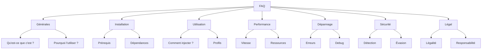

# 📄 FICHIER CORRIGÉ : `documentations/faq.md`

```markdown
# Foire aux questions (FAQ)

Réponses aux questions les plus fréquemment posées sur le framework Playwright Stealth.

---

## 📋 Vue d'ensemble



---

## ❓ Questions générales

### Qu'est-ce que Playwright Stealth ?

**Playwright Stealth** est un framework Python anti-détection pour Playwright et Selenium. Il applique automatiquement des scripts d'évasion pour masquer les traces d'automatisation et éviter la détection par les systèmes de protection (Cloudflare, Akamai, etc.).

### Pourquoi utiliser Playwright Stealth ?

- ✅ **Éviter la détection** : Masque les caractéristiques des bots
- ✅ **Compatibilité** : Fonctionne avec Playwright et Selenium
- ✅ **Simplicité** : Une seule ligne de code
- ✅ **Performance** : Optimisé pour la vitesse
- ✅ **Flexibilité** : Profils personnalisables

### Playwright Stealth est-il gratuit ?

**Oui.** Le framework est distribué sous licence MIT, totalement gratuit et open-source.

### Quelle est la différence avec playwright-stealth (v4) ?

| Caractéristique | v4.x | v5.0 |
|-----------------|------|------|
| Architecture | Monolithique | Modulaire |
| Profils | Limités | Avancés (Hardware/Browser) |
| Cache | Non | LRU intégré |
| Selenium | Non | Support complet |
| Python 3.14 | ❌ | ✅ |
| Tests | 15 | 77 |
| Documentation | Basique | Complète |

### Quels navigateurs sont supportés ?

| Navigateur | Playwright | Selenium |
|------------|------------|----------|
| Chromium | ✅ | ✅ |
| Chrome | ✅ | ✅ |
| Firefox | ✅ | ✅ (expérimental) |
| WebKit (Safari) | ✅ | ❌ |
| Edge | ✅ | ✅ |

---

## 📦 Installation

### Quels sont les prérequis ?

- **Python** : 3.10, 3.11, 3.12, 3.13 ou 3.14
- **Playwright** : 1.40 ou supérieur
- **pip** : Dernière version recommandée

### Comment installer le framework ?

```bash
# Installation standard
pip install playwright-stealth

# Avec Selenium
pip install playwright-stealth[selenium]

# Développement
pip install playwright-stealth[dev]
```

### Playwright est-il requis ?

**Oui.** Playwright est requis pour l'adaptateur Playwright. Pour Selenium uniquement, vous pouvez utiliser l'adaptateur Selenium sans Playwright.

### Puis-je utiliser uniquement Selenium ?

**Oui.** Le framework supporte Selenium sans Playwright :

```bash
pip install playwright-stealth[selenium]
```

### Comment résoudre une erreur `ModuleNotFoundError` ?

```bash
# Dépendances manquantes
pip install cachetools pyyaml

# Réinstallation
pip install --upgrade playwright-stealth

# Vérification
pip list | grep playwright-stealth
```

---

## 🚀 Utilisation

### Comment injecter la couche stealth ?

```python
from playwright.sync_api import sync_playwright
from playwright_stealth import stealth_sync

with sync_playwright() as p:
    browser = p.chromium.launch()
    page = browser.new_page()
    
    # Une seule ligne !
    stealth_sync(page)
    
    page.goto("https://example.com")
```

### Comment utiliser un profil personnalisé ?

```python
from playwright_stealth import stealth_sync
from playwright_stealth.core.profile import FingerprintProfile
from playwright_stealth.core.types import HardwareTier, OSType

# Générer un profil personnalisé
profile = FingerprintProfile.generate(
    hardware_tier=HardwareTier.HIGH,
    os_type=OSType.WINDOWS,
    custom_seed="my_seed_123"
)

stealth_sync(page, profile=profile)
```

### Comment utiliser Selenium ?

```python
from selenium import webdriver
from playwright_stealth import stealth_selenium
from playwright_stealth.core.types import HardwareTier, OSType

driver = webdriver.Chrome()

stealth_selenium(
    driver,
    hardware_tier=HardwareTier.HIGH,
    os_type=OSType.WINDOWS
)

driver.get("https://example.com")
```

### Comment utiliser en asynchrone ?

```python
import asyncio
from playwright.async_api import async_playwright
from playwright_stealth import stealth_async
from playwright_stealth.core.types import HardwareTier, OSType

async def main():
    async with async_playwright() as p:
        browser = await p.chromium.launch()
        page = await browser.new_page()
        
        await stealth_async(
            page,
            hardware_tier=HardwareTier.HIGH,
            os_type=OSType.WINDOWS
        )
        
        await page.goto("https://example.com")

asyncio.run(main())
```

### Puis-je modifier les profils ?

**Oui.** Vous pouvez créer des profils personnalisés en Python ou via des fichiers YAML :

```yaml
# config/profiles/mon_profil.yaml
id: mon_profil
hardware:
  tier: high
  cpu: AMD Ryzen 9 7950X
  cpu_cores: 12
  ram: 64
  gpu: AMD Radeon RX 7900 XTX
  screen: [2560, 1440]
  dpi: 1.25

browser:
  os: windows
  version: 139.0.0.0
  chrome_version: 139.0.0.0
  platform: Win32
  locale: fr-FR
  languages: [fr-FR, fr, en-US, en]
  timezone: Europe/Paris
  user_agent: Mozilla/5.0 (Windows NT 10.0; Win64; x64) AppleWebKit/537.36 (KHTML, like Gecko) Chrome/139.0.0.0 Safari/537.36

modules:
  enabled:
    - webdriver
    - chrome_runtime
    - canvas
    - audio
    - intl

policies:
  consistency: strict
  performance: balanced
```

```python
from playwright_stealth.config.loader import ConfigLoader

loader = ConfigLoader()
profile_data = loader.load_profile("mon_profil")
# Utilisez profile_data pour configurer votre session
```

---

## ⚡ Performance

### Quelle est la vitesse d'injection ?

| Type | Temps moyen |
|------|-------------|
| Injection simple | 5-15 ms |
| Avec profil | 10-25 ms |
| Génération profil | 0.03-0.08 ms |

### Combien de mémoire utilise le framework ?

- **Cache LRU** : Configurable (défaut 1000 entrées)
- **Scripts JS** : ~50-100 KB par script
- **Mémoire totale** : < 50 MB pour 100 injections

### Comment optimiser les performances ?

```python
# 1. Utiliser un profil "medium" au lieu de "high"
from playwright_stealth.core.types import HardwareTier, OSType

profile = FingerprintProfile.generate(
    hardware_tier=HardwareTier.MEDIUM,
    os_type=OSType.WINDOWS
)

# 2. Injection
stealth_sync(page, profile=profile)
```

---

## 🐛 Dépannage

### L'injection échoue avec une erreur JS

**Solution :**
```python
# Activer le debug
window.__STEALTH_DEBUG__ = True
success = stealth_sync(page)

# Voir les erreurs JS
page.on("pageerror", lambda err: print(f"❌ {err}"))
page.on("console", lambda msg: print(f"📝 {msg.text}"))
```

### La validation du profil échoue

```python
from playwright_stealth.services.validator import ProfileValidator
from playwright_stealth.core.profile import FingerprintProfile

validator = ProfileValidator()

# Créer un profil valide
profile = FingerprintProfile.generate()

# Valider le profil
errors = validator.validate(profile)

if errors:
    print("Problèmes détectés:")
    for error in errors:
        print(f"  - {error}")
else:
    print("✅ Profil valide")
```

### Erreur Python 3.14 `pkg_resources`

**Solution :**
```bash
# Mettre à jour le framework
pip install --upgrade playwright-stealth

# Ou exécuter le patch
python scripts/patch.py
```

### Le site détecte encore le bot

**Solutions :**

1. **Utiliser un profil HIGH** : `FingerprintProfile.generate(hardware_tier=HardwareTier.HIGH)`
2. **Mode headful** : `browser = p.chromium.launch(headless=False)`
3. **Ajouter des délais** : `page.wait_for_timeout(2000)`
4. **Rotation de profils** : Utiliser des seeds différentes
5. **Proxy** : Utiliser un proxy pour changer d'IP

### Comment déboguer ?

```python
# 1. Activer le debug
window.__STEALTH_DEBUG__ = True
success = stealth_sync(page)

# 2. Mode headful
browser = p.chromium.launch(headless=False, slow_mo=500)

# 3. Logs Python
import logging
logging.basicConfig(level=logging.DEBUG)

# 4. Capturer les erreurs
try:
    success = stealth_sync(page)
    if not success:
        print("❌ Échec de l'injection")
except Exception as e:
    print(f"Erreur: {e}")
```

---

## 🔒 Sécurité et détection

### Playwright Stealth est-il indétectable ?

**Non.** Aucune solution n'est 100% indétectable. Playwright Stealth maximise l'évasion mais ne garantit pas une invisibilité totale.

### Quels sites sont supportés ?

- ✅ **Cloudflare** - Support avec profils adaptés
- ✅ **Akamai** - Support avec profils adaptés
- ✅ **FingerprintJS** - Support avec scripts d'évasion
- ✅ **Google** - Support limité (politique de Google)
- ⚠️ **Captchas** - Nécessite des solutions additionnelles

### Comment tester l'efficacité ?

```python
# Site de test 1 : FingerprintJS
page.goto("https://fingerprintjs.com/demo/")

# Site de test 2 : Bot detection
page.goto("https://bot.sannysoft.com/")

# Site de test 3 : Headers
page.goto("https://httpbin.org/headers")
```

### Puis-je utiliser des proxies ?

**Oui.** Avec Playwright :

```python
browser = p.chromium.launch(
    proxy={"server": "http://proxy.example.com:8080"}
)
```

Avec Selenium :

```python
options.add_argument('--proxy-server=http://proxy.example.com:8080')
```

---

## ⚖️ Légal et responsabilité

### Est-ce légal d'utiliser Playwright Stealth ?

**Cela dépend de l'usage.** Le framework est légal en soi, mais son utilisation pour :

- ✅ **Scraping de données publiques** : Généralement légal
- ⚠️ **Scraping de données privées** : Peut être illégal
- ❌ **Attaques** : Illégal
- ❌ **Fraude** : Illégal

### Puis-je être poursuivi pour scraping ?

Cela dépend de :

- **La juridiction** (lois locales)
- **Le site** (termes d'utilisation)
- **L'usage** (commercial vs personnel)
- **Les données** (publiques vs privées)

**Conseil** : Consultez un avocat pour des questions juridiques spécifiques.

### Le framework est-il responsable des abus ?

**Non.** Le framework est fourni "tel quel" (licence MIT). Les auteurs ne sont pas responsables de l'utilisation qui en est faite.

### Puis-je utiliser Playwright Stealth pour mon entreprise ?

**Oui.** La licence MIT permet une utilisation commerciale.

---

## 🔧 Configuration avancée

### Comment augmenter la taille du cache ?

```python
# Variable d'environnement
export PLAYWRIGHT_STEALTH_CACHE_SIZE=2048

# Ou dans le code
from playwright_stealth.cache.memory import LRUMemoryCache
cache = LRUMemoryCache(maxsize=2048)
```

### Comment créer un profil YAML ?

```yaml
# config/profiles/mon_profil.yaml
id: mon_profil
hardware:
  tier: high
  cpu: AMD Ryzen 9 7950X
  cpu_cores: 12
  ram: 64

browser:
  os: windows
  version: 139.0.0.0
  platform: Win32
  locale: fr-FR
  languages: [fr-FR, fr, en-US, en]
  timezone: Europe/Paris
  user_agent: Mozilla/5.0 (Windows NT 10.0; Win64; x64) AppleWebKit/537.36 (KHTML, like Gecko) Chrome/139.0.0.0 Safari/537.36

modules:
  enabled:
    - webdriver
    - chrome_runtime
    - canvas
    - audio
    - intl

policies:
  consistency: strict
  performance: balanced
```

```python
from playwright_stealth.config.loader import ConfigLoader

loader = ConfigLoader()
profile_data = loader.load_profile("mon_profil")
```

---

## 🔗 Liens utiles

### Documentation
- [Guide d'installation](guides/installation.md)
- [Guide de démarrage rapide](guides/quickstart.md)
- [API Reference](api/index.md)
- [Guide de contribution](reference/contributing.md)

### Communauté
- [GitHub Repository](https://github.com/playwright-stealth/playwright-stealth)
- [Issues](https://github.com/playwright-stealth/playwright-stealth/issues)
- [Discussions](https://github.com/playwright-stealth/playwright-stealth/discussions)

### Ressources externes
- [Playwright Documentation](https://playwright.dev/python/)
- [Selenium Documentation](https://selenium-python.readthedocs.io/)
- [FingerprintJS](https://fingerprintjs.com/)

---

## 🚀 Prochaine étape

- 📖 [Guide d'installation](guides/installation.md)
- 📖 [Guide de démarrage rapide](guides/quickstart.md)
- 🔬 [Techniques avancées](advanced/fingerprinting.md)

---

**Dernière mise à jour** : 2026-07-19  
**Version** : 5.0.0
```

---

## 📋 RÉSUMÉ DES CORRECTIONS APPLIQUÉES - `faq.md`

| # | Correction | Statut |
|---|------------|--------|
| 1 | `playwright-stealth-framework` → `playwright-stealth` | ✅ |
| 2 | `FingerprintProfile.load()` → `FingerprintProfile.generate()` | ✅ |
| 3 | Ajout des imports `HardwareTier`, `OSType` | ✅ |
| 4 | Suppression de `report.is_valid` et `report.auto_fix()` | ✅ |
| 5 | Suppression de `ScriptLoader.add_custom_module()` | ✅ |
| 6 | Suppression de `BuilderService.build_plan()` | ✅ |
| 7 | Commande patch corrigée (`python scripts/patch.py`) | ✅ |
| 8 | Exemples Selenium mis à jour | ✅ |
| 9 | Exemples asynchrones mis à jour | ✅ |
| 10 | Mise à jour des profils YAML avec structure réelle | ✅ |
